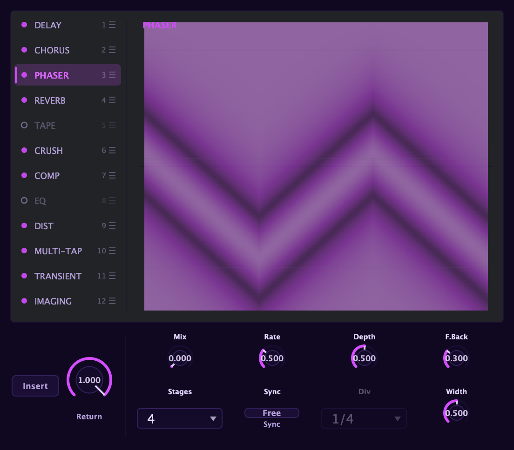

Aconite's effects live in a **12-slot chain** on the stereo scene bus. Each slot
can be enabled independently, run as an **insert** or a **send/return**, and
dragged to reorder, so the same set of effects can sound completely different
depending on their order. The master saturation and bus glue controls live in the
[Master band](/master/master-band/), distinct from the rack.

Each **scene** has its own copy of this rack, so Scene A and Scene B can carry
completely different effects; the two scene mixes are combined at the shared master
stage. Switch which rack you are editing with the **Edit: Scene A / B** box in the
header. See [Scenes](/performance/scenes/).

## Where the rack sits

The FX rack processes the mixed, stereo output of all voices together, after the
oscillators, the waveshaper, the filters, and the amp. Every voice you play goes
through the rack as a single stereo stream, so a reverb tail or a delay repeat
wraps the entire ensemble rather than treating voices individually.

Every effect starts with its mix at zero, so a fresh patch passes audio through
untouched. You dial in only what you want.

## The rack panel

The rack presents all twelve effects as a single card. On the left, a vertical list
shows each effect in signal-flow order, with three things per row:

- An **enable dot** to the left of the name; click it to hard-bypass that slot without
  changing any of its settings.
- The **effect name**, which you click to select and view.
- The **slot number**, which follows the effect when you reorder.

Clicking a row selects that effect: its controls and its hero visualization fill the
right side of the card. Controls that don't apply to the current mode or algorithm
grey out in place (the layout never jumps around) and a short hint below the
controls explains what the current selection has gated off.

## Enabling and bypassing

Click the **dot** to the left of any effect name to toggle that slot on or off. A
bypassed slot is fully transparent: the signal passes through as if the slot weren't
there, and all its settings are preserved. This makes it easy to compare a patch
with and without a given effect, or to leave a slot dialled in but switched off
until you decide you want it.

## Reordering the chain

Drag any row up or down to change its position in the chain. The signal flows through
the slots top to bottom in the order you see them. Reordering is non-destructive: the
slot's settings travel with it.

Two effects are always inserted in place and cannot run as sends: the **Multi-tap
delay** (its **Feedback high-pass** keeps long regenerating patterns from building
low-end mud) and the **Stereo imager**. Everything else can be either an insert or a send.

## Insert vs send/return

Each effect independently chooses how it connects into the chain:

- **Insert**: the effect processes the signal in place, in sequence with the rest of
  the chain. This is the default. An insert's dry/wet mix blends the original signal
  with the processed result at that point in the chain.
- **Send/return**: the bus taps a copy of the signal, runs the effect at 100% wet,
  and folds the result back in at a **Return** level you set. The dry insert path is
  untouched. Sends run in parallel with each other: a send never feeds another send.

Send mode is ideal for parallel compression (the compressor hears the full signal
without affecting the dry path), reverb throws (the dry voice stays up front while a
copy blooms into the tail), and blended saturation (tape warmth folded in
underneath, not replacing the sound).

## FX modulation

Effect mix levels and key parameters are modulation destinations in Aconite's bus
modulation tier: two bus LFOs and an 8-slot bus matrix. You can route a bus LFO, a
macro, an arp lane, or a Curve lane onto reverb size, chorus depth, delay feedback,
EQ tilt, master gain, and more, making the whole mix breathe and move over time.
See the [modulation overview](/modulation/overview/) for how the bus
tier connects to the rest of the modulation system.

## Order matters: practical guidance

The chain's order shapes the sound as much as the individual settings. A few
principles to orient you:

**Distortion before delay and reverb.** If distortion follows a long delay, it
clips the repeats at their full level: the repeats saturate just as hard as the
first note. That can be a valid effect, but it is usually not what you want. Running
distortion first lets the delay and reverb process an already-shaped signal, and the
repeats decay naturally rather than clipping.

**Compression before or after distortion?** Before distortion, a compressor evens
out the input level so drive behaves predictably: the hit of each note is
controlled before it reaches the clipper. After distortion, compression tames the
peaks and adds punch, but the saturation character is set by the uncompressed input
hitting the drive stage first. Both orders are musically valid; try both.

**Modulation effects (chorus, phaser) before or after reverb?** Before reverb, the
chorus smears pitch into the room and the reverb blurs it further into a washy wash.
After reverb, the chorus modulates the already-diffuse tail and the effect is more
subtle. For shimmering pads, chorus → reverb is classic. For a cleaner, spacious
sound, try reverb → chorus.

**EQ last.** The parametric EQ works well as a final tone-shaping step after
everything else, trimming the result rather than shaping a signal that further
effects will alter. That said, EQ before distortion is its own creative tool:
boosting the mid before a drive stage emphasises those frequencies in the overtones.

**Stereo imager at the end.** The stereo imager should almost always be the last
slot, working on the final sum. If you place it mid-chain, the effects that follow
it won't know about the width changes.

**Tape early for analogue character.** Tape saturation works like a "colour" stage:
running it early in the chain means every subsequent effect processes an already
warmed-up signal. Running it late applies the warmth and wow/flutter on top of
effects like reverb, which can make a tail flutter realistically.

The default slot order (chorus → phaser → delay → multi-tap → reverb → tape →
distortion → bit-crusher → compressor → transient shaper → EQ → stereo imager) is
a sensible starting point, but none of it is fixed. Drag freely.
