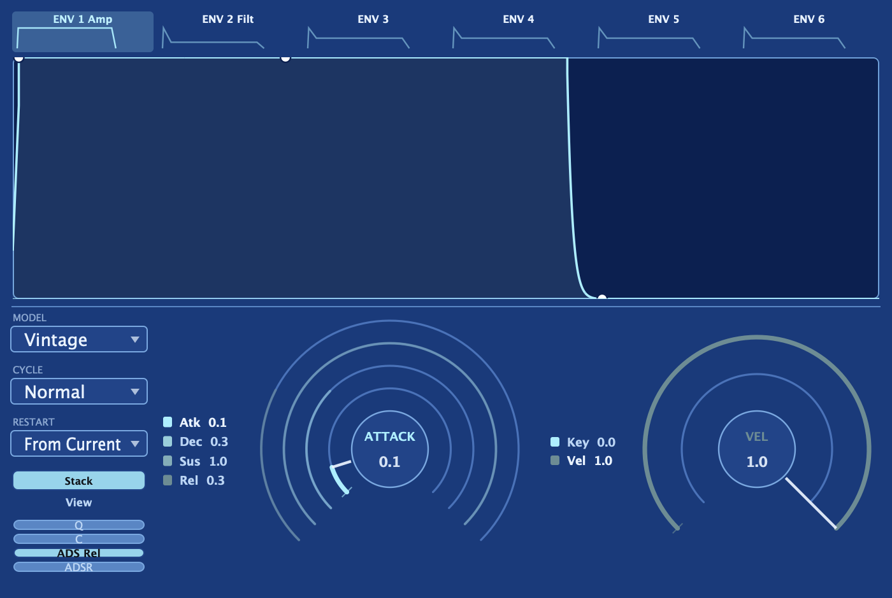

Aconite gives you a pool of **six routable envelopes**. Two are wired by default (the
amp envelope controls overall volume, and the filter envelope shapes the cutoff), but all
six are full, independent envelopes you can route to any destination in the
[modulation matrix](/aconite-manual/modulation/matrix/). Env 3 through 6 start with
nothing connected; they exist so you can put a third, fourth, fifth, or sixth moving
shape anywhere in the patch.

Every envelope is identical in capability. Switching tabs in the Envelopes card swaps
in that envelope's own controls (shape, model, times, and cycle mode) without touching
the others.

## The ADSR controls

Each envelope has four time controls: **Attack**, **Decay**, **Sustain**, and **Release**.
Attack is how long the envelope takes to rise from zero, Decay is how long it falls to the
Sustain level, Sustain is the held level while the key is down, and Release is how long it
takes to fall to zero after you let go.

Two additional controls refine the shape:

- **Velocity**: scales how much a harder keystroke deepens the envelope's output. The amp
  envelope defaults to full velocity sensitivity (harder playing is louder). The filter
  envelope defaults to zero, so velocity does not move the filter cutoff until you dial it in.
  The free envelopes (Env 3–6) also default to velocity-independent; they modulate their
  destination at a fixed depth until you route them, at which point their output tracks
  velocity according to this setting.
- **Key Follow**: scales the envelope times with pitch, pivoting around middle C. Notes
  above middle C get shorter attack, decay, and release times; notes below get longer ones.
  At zero it has no effect.

And two toggles reshape the contour's output curve:

- **Curve (C)**: applies a soft S-shape to the contour, rounding the attacks and releases
  into a smoother arc.
- **Quantize (Q)**: steps the output into discrete levels for a jagged, lo-fi contour.

Both are off by default and can be combined with any model.

## The five voicing models

Each envelope independently chooses a **voicing model** that sets the character of its
attack, decay, and release curves:

| Model | Character |
|-------|-----------|
| **ADS** | Punchy three-stage: the release reuses the decay time for a snappy gate. |
| **Analogue** | Rounded, RC-style exponential, the everyday analog default. |
| **Digital** | Near-linear, precise, and fast. |
| **Vintage** | Linear attack into a rounded-exponential decay and release. |
| **Classic** | Rounded-exponential attack into a linear decay and release. |

The ADS model also has an **ADS Release** toggle. With it on, the release stage shares the
decay time, giving a true three-stage attack/decay/sustain; with it off, note-off collapses
to a fast stop. On the other four models, the dedicated Release knob always applies.

## Cycle mode

Every envelope has a **Cycle** setting that changes what happens when it reaches the
sustain level:

- **Normal**: the classic behavior. The envelope rises, falls to sustain, holds while the
  key is down, and releases on note-off.
- **Loop**: on reaching sustain, the envelope jumps back to attack and re-runs the
  attack-to-decay arc while the key is held. Release still fires on note-off. This turns
  the envelope into a note-synced, tempo-lockable shape, a natural complement to
  [the LFOs](/aconite-manual/modulation/lfos/).
- **One-shot**: the envelope plays straight through to release on note-on, ignoring when
  you let go. Useful for percussion, transients, or any shape that must complete regardless
  of note length.

In Loop mode each envelope can also lock to the transport. When Sync is on you choose a
beat division, and one loop cycle lasts exactly that musical length.

## Restart behavior

**Restart** decides where the envelope begins when a new note triggers while it is already
running:

- **From Current**: retriggers from wherever the envelope already is. This is the analog
  behavior: no click, smooth re-attack.
- **From Zero**: re-attacks from silence, giving a consistent, clean start on every note.

Restart governs the envelope's starting level only. It is separate and orthogonal from the
**Transient** control on the Voice/Play card, which resets oscillator and filter state on
retrigger. The two controls are independent; you can combine any Restart setting with any
Transient setting.

## Routing an envelope to a destination

All six envelopes are modulation sources. The quickest way to connect one:

1. Right-click the knob you want to move.
2. Choose **Add modulation**, then pick the envelope by name: Amp Env, Filter Env, Env 3,
   and so on.
3. A modulation route is created at a sensible starting depth. A small dot on the knob
   marks that it now has a source, and a colored arc animates to show the live push.

To set a precise depth or add a Via transform, open the
[modulation matrix](/aconite-manual/modulation/matrix/) and adjust the row there.

:::tip
Envelope 3 through 6 start free; nothing is routed to them. Think of them as blank shapes
you can assign once you know what needs to move in your patch: LFO rate, oscillator detune,
[filter morph](/aconite-manual/filters/the-two-filters/), waveshaper depth, or anything else
the matrix lists.
:::

## Draw mode and the ADSR knobs

Any envelope can switch to [Draw mode](/aconite-manual/envelopes/drawable/), replacing the
ADSR shape with a hand-drawn multi-segment contour. The two views stay in sync: edits you
make in the draw canvas mirror back to the A/D/S/R knobs, and adjusting the knobs reshapes
the drawn contour to match. You can move between the two representations freely without
losing your intent.

Each envelope's drawn contour, its sustain marker, and its loop region are stored per scene
and saved with the preset, so different scenes can carry entirely different drawn shapes.

## The live playhead

While a tab is selected, the envelope display shows a **live playhead** riding the current
position in real time. In normal ADSR mode it moves through the attack, decay, sustain, and
release stages as the voice runs. In [Draw mode](/aconite-manual/envelopes/drawable/) it
tracks the hand-drawn contour instead.
