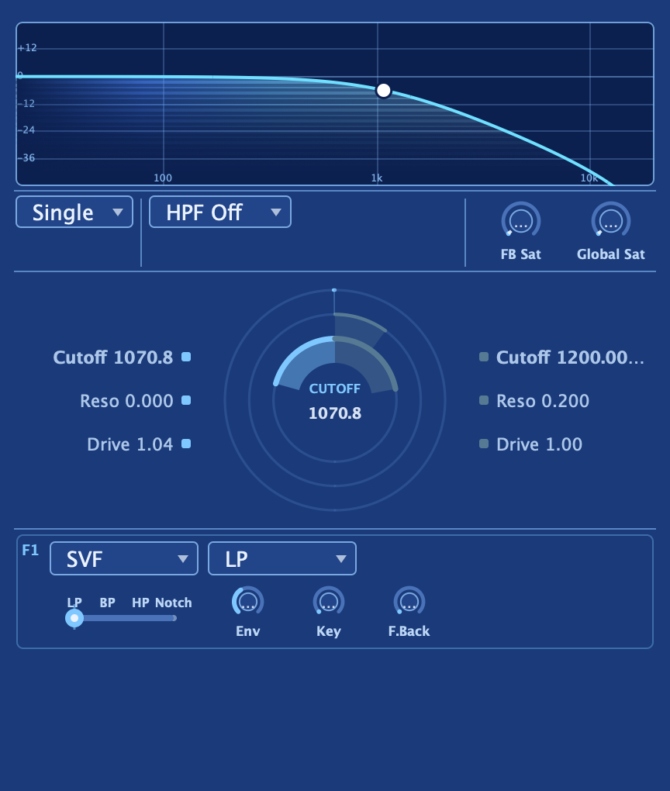

The filter block is the heart of Aconite's character. Each of its two independent
filters offers seven models — **Ladder, SVF, Bite, Multimode, Cascade, Diode, and
Acid** — with Cutoff, Resonance, and Drive, a discrete Mode plus a continuous,
modulatable **Morph**, key-tracking, envelope amount, and the **Voicing** (Clean /
Analog) and **Depth** character controls. These controls interact in deliberate
ways worth learning; that interaction is what makes the section reward exploration.

## The seven models

Every model is available on both filters, and each one has its own heritage and its own
sonic personality. Choosing a model shapes not just tone but behavior — how resonance
blooms, how Drive bites, and how hard the filter pushes back.

### Ladder

The classic 4-pole low-pass, in the lineage of the synthesizers that defined what a filter
could be. A saturator lives inside the resonance loop, so as you push Resonance, instead of
blowing up into a harsh spike, the peak compresses into a warm, characteristic growl. Near
maximum Resonance the filter approaches self-oscillation. Rich, vintage, weighty — the
obvious choice for basses, leads, and anything that needs "that" sound.

### SVF

A clean, versatile state-variable filter producing low-pass, band-pass, high-pass, and notch
responses. It is the lightest model on CPU and the right choice when you need clarity —
bright pads, high-polyphony patches, or a foundation you can build character onto with Drive
and Feedback. A light input drive adds gentle warmth when you push it, but it never becomes
aggressive.

### Bite

An aggressive Sallen-Key design in the MS-20 lineage. Its feedback saturator lets the
resonance scream and grow before a gentle limiter keeps it musical, and it will fully
self-oscillate at maximum Resonance. This is the model to reach for when you want something
forward, gnarly, and slightly unpredictable — sharp leads, harsh sweeps, grit-forward sound
design.

### Multimode

A Roland-style tapped 4-pole ladder that produces low-pass, band-pass, high-pass, and notch
responses from a single structure, plus an intermediate LP2 slope. Drive saturates the input
only, keeping all the filter responses clean and well-defined even under heavy gain. A very
useful model when you want multi-response capability without sacrificing tonal clarity.

### Cascade

A cleaner Moog cascade with a continuous **Drive** range that sweeps from Clean (exactly
linear, no coloration) through to Rough (tames resonance as it distorts). Clean mode is ideal
for pads and strings that need air without grit. Cascade also offers a slope switch between
12 dB/oct and 24 dB/oct — use 12 for more open, airy sounds; 24 for thick, closed-down
character.

### Diode

Modeled in the diode-ladder tradition, with a gentler frequency knee than the Ladder and a
singing resonance that peaks slightly sharp of the cutoff frequency — a quirk of the
inter-stage diode coupling that gives it an airy, elastic quality. The passband stays full
as Resonance rises, so it never sounds thin. Think of this as the neutral acid flavor:
present and musical without being imposing.

### Acid

A strict acid-lineage filter with four poles and spread poles for a gentler knee. Its
resonance sits right on the edge of oscillation, a feedback high-pass emphasizes the
characteristic cut, and the uncompensated passband means resonance literally eats the low
end — a feature. The tuning-stable peak stays locked as you modulate. When you need the
303-style squelch, start here.

---

:::tip
The **Ladder** and **Diode** models have in-loop saturation that can produce harmonics above
the Nyquist threshold at high Drive and Resonance. If you hear aliasing artifacts on very
driven patches, raise **Quality** in the global settings. At 4× or 8× the difference is
audible.
:::

## Mode and Morph

Three models — **SVF**, **Bite**, and **Multimode** — go further than just switching
between responses: they produce a continuous blend between them.

The **Mode** selector snaps to a discrete response (LP, BP, HP, Notch — plus LP2 on
Multimode). The **Morph** control is a signed offset from that position that blends
continuously between the adjacent modes. Rather than clicking between responses, you can
sweep through them smoothly — or, more powerfully, route a modulation source to Morph 1 or
Morph 2 in the [modulation matrix](/aconite-manual/modulation/matrix/) and let an LFO or
envelope carry the filter from low-pass through band-pass into high-pass inside a single
patch.

The Ladder, Cascade, Diode, and Acid models are fixed-mode — they ignore Morph, since their
character comes from the specific behavior of one response, not a blend.

## Cutoff, key-tracking, and envelope amount

**Cutoff** sets the filter's corner frequency across the full audible range. It responds to
several modulation inputs at once — the filter envelope, LFOs, key-tracking, the step
sequencer, and the modulation matrix all sum onto it — so a single knob position is really
a base value that modulation rides on top of.

**Key Track** ties the cutoff to the note you're playing: at 100%, the filter tracks
exactly one octave per octave, keeping timbre consistent as you move up the keyboard. At 0%
the filter stays fixed. Values in between give a softer tracking that is natural for many
pads and leads.

**Env Amt** (envelope amount) scales how far the [filter envelope](/aconite-manual/envelopes/pool/)
pushes cutoff from its resting position on each note. A positive value opens the filter on
attack; a negative value closes it. Pair with Decay and Sustain to create plucks, stabs,
and evolving filter sweeps. Both Env Amt and Key Track can be linked to Filter 1 when
Filter 2 is running independently, or kept separate — see
[Routing & configs](/aconite-manual/filters/routing/).

## Resonance and Drive

**Resonance** sets the Q — the emphasis at the cutoff frequency. Every model approaches
self-oscillation near maximum, bounded so it stays musical rather than blowing up. The exact
character of that peak varies by model: sharp and squelchy on SVF, compressed and growly on
Ladder, on-the-edge on Acid.

**Drive** is input gain into the filter's nonlinearity, and what "Drive" means is
model-specific:

- On **Ladder, Bite, Diode, and Acid** — pre-gain into the in-loop saturator, adding
  harmonic saturation and compressing the resonance peak under heavy gain.
- On **Multimode** — input saturation only, keeping the filter responses clean.
- On **Cascade** — the blend between Clean (linear) and Rough (tames resonance as it distorts).
- On **SVF** — a light input soft-drive for gentle warmth.

Both Resonance and Drive are modulation matrix destinations.

## Voicing and Depth

**Voicing** and **Depth** are available on the **Ladder** and **Diode** models and act
inside the filter's saturation character — a good example of the kind of control that sounds
redundant until you hear it.

**Voicing** switches between **Clean** and **Analog** internal saturation paths. Despite the
names, Clean is the screamier option: it has a taller, sharper, more squelchy resonance,
because its low-distortion path lets the peak ring freely. Analog compresses and tames the
resonance the way real hardware does, adding body and grit as you push Drive. Think of
Voicing as a resonance-character control first, and a distortion-character control second.

**Depth** sets the amount of the Analog path's internal clipping. Under Clean voicing it
does nothing. Under Analog, turning Depth up increases the grit and compression — useful for
matching the feel of particular hardware or finding a middle ground between singing and
saturated.

Both filters carry their own Voicing, Drive, and Depth, so you can pair a screaming Clean
Filter 1 against a composed Analog Filter 2 — or any other combination that suits the
sound you are after.

## How the controls interact

These are the behaviors worth knowing before you start exploring:

- **Clean voicing is the screamier one.** It has the sharper, more squelchy peak. Analog
  tames it. If resonance sounds too polite, try Clean.
- **Feedback and Resonance are antagonistic at high Q.** Cranking Feedback while Resonance
  is high does not add more scream — it collapses the sharp peak into a broader growl below
  cutoff. Feedback is a "growl / tame the scream" color, not extra resonance. See
  [Feedback & FB Sat](/aconite-manual/filters/feedback/) for the full picture.
- **Depth only acts under Analog voicing.** Under Clean, it is silent.
- **Morph does nothing on fixed-mode models.** Save it for SVF, Bite, and Multimode.

The filter section is designed to reward that kind of systematic exploration. Each control
acts at a different physical point in the signal path, and understanding where is the depth
that turns the section from "many knobs" into a coherent instrument.
