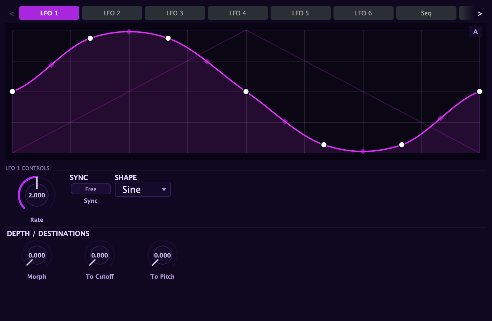

A patch is more than a static tone. The thing that separates a living, breathing sound from
a frozen one is **modulation** — sources that move over time, routed to destinations that
respond. Aconite's modulation system is built around one idea: anything that generates
movement can be pointed at anything that accepts it.

## Sources, destinations, and the matrix

The modulation system has three parts:

**Sources** generate values that change over time. Aconite has more than forty of them:

- The [envelope pool](/aconite-manual/envelopes/pool/) — six ADSR envelopes, each also
  available in [drawn contour](/aconite-manual/envelopes/drawable/) form. Note-triggered,
  note-released.
- The [LFOs](/aconite-manual/modulation/lfos/) — six drawable, tempo-syncable oscillators
  that run freely or retrigger on each note.
- The [envelope follower](/aconite-manual/modulation/env-follower/) — a source that tracks
  the signal's own level and turns dynamics into modulation.
- The **step sequencer** and the **Performer** — pattern generators with their own clocks,
  described in detail below.
- **Curve 1–4** — four drawable, pattern-synced automation lanes that loop a hand-drawn
  shape against the transport, independent of note events.
- **Noise** — an audio-rate random signal for thick, dense modulation: FM grit, PWM flutter,
  and cutoff textures that no LFO shape can produce.
- **Performance controls** — velocity, key position (keytrack), pitch and mod wheels, MPE
  pressure and slide, four macro knobs, and eight learnable MIDI CC inputs.
- **Arp lanes** — the arpeggiator exposes its step position, velocity accent, and gate as
  sources, so the arp can modulate anything it touches.

**Destinations** are the controls that respond to modulation. The [modulation
matrix](/aconite-manual/modulation/matrix/) lists seventy-six of them across every section:
oscillator pitch and level, filter cutoff, resonance, drive and morph, envelope times,
LFO rates, waveshaper parameters, pan, and more.

**The matrix** is where sources meet destinations. Each of the eight slots in the per-voice
matrix takes a source, a destination, an optional transform, and a depth amount. The
[matrix chapter](/aconite-manual/modulation/matrix/) covers this in full.

## The Modulators panel

The **Modulators** panel holds Aconite's standalone generators — the sources that exist
on their own clock, independent of note events. A scrolling **tab strip** across the top
selects one at a time:

| Tab | What it is |
|-----|------------|
| LFO 1 – 6 | Six drawable low-frequency oscillators |
| Seq | The step sequencer |
| Perf | The Performer curve sequencer |
| Bus LFO 1 – 2 | Two LFOs dedicated to the effects and master bus |
| Env Follow | The envelope follower |

Each tab shows that source's editor and controls. Setting a source up here is separate from
routing it — you shape the LFO, draw the step levels, or set the follower's attack time,
then wire it to a destination in the [matrix](/aconite-manual/modulation/matrix/) or through
a right-click on any knob.

## The right-click shortcut

You do not have to open the matrix to add modulation. Right-click any knob and choose
**Add modulation** from the menu that appears. A submenu lists every available source;
pick one and a route is created at a sensible default depth. The dot that appears on the
knob marks the destination as modulated, and a colored arc animates in real time to show
how far the source is currently pushing the value.

This is the fastest workflow: shape your sound first, then right-click the controls you
want to move and assign sources directly. The matrix fills in automatically. Visit it when
you want to tune depths precisely, add Via transforms, or review everything that is moving
in the patch at once.

## How the two tiers fit together

Aconite's modulation splits into two tiers:

- **Per-voice modulation** — each note carries its own copy of every envelope, LFO, and
  follower. One note's filter envelope does not interfere with another's. This is what
  makes a legato chord shimmer rather than collapse into a single moving curve.
- **Bus modulation** — a second set of two LFOs and eight routing slots runs once for
  the whole mix, modulating the [effects rack](/aconite-manual/effects/using-the-rack/)
  and master output. A macro can breathe the reverb size, a bus LFO can auto-pan the
  whole output, or a drawn curve lane can automate the EQ tilt across a section.

Both tiers share the same [matrix](/aconite-manual/modulation/matrix/) grid. Choosing a
bus destination in the matrix automatically routes to the bus tier; choosing a voice
destination routes per-voice. The scope badge in each row tells you which is active.

## The step sequencer

The step sequencer advances through a grid of levels one step at a time, clocked by its own
rate. You draw the step levels in the shape editor — the same editor used by the LFOs — and
the sequencer reads them in order.

- **Direction** — choose how the playhead moves through the steps: **Forward** (left to
  right), **Reverse** (right to left), **Ping-Pong** (forward then backward, alternating),
  or **Random** (picks an unpredictable step each clock tick).
- **Per-step Glide** — mark individual steps as glided. A glided step slides toward its
  level over its full duration rather than jumping immediately, smoothing the transition
  from the previous value. Non-glided steps jump cleanly.
- **Transport lock** — when the step sequencer is synced to tempo, Transport lock aligns
  the playhead to the bar. Instead of free-running from note-on, the sequence locks to song
  position, so every pass starts at the same point in the bar.
- **Rate** — one full pass through all steps per cycle, in free Hz or locked to a tempo
  division.

Route the step sequencer from the [modulation matrix](/aconite-manual/modulation/matrix/)
or right-click any knob and choose it under **Add modulation**.

## The Performer

The Performer is a curve-per-step sequencer. Where the step sequencer plays a single flat
level per step, the Performer plays a **whole shaped sub-curve** over each step's duration.
The shape for each step is chosen from a per-step curve library:

| Shape | Character |
|-------|-----------|
| **Saw Dn** | Falls across the step |
| **Saw Up** | Rises across the step |
| **Triangle** | Rises then falls |
| **Decay** | Starts high, decays to zero |
| **Rise** | Starts low, rises to the step level |
| **Pulse** | A rectangular pulse mid-step |
| **Sine** | A full sine arc over the step |
| **Flat** | Holds the step level — equivalent to the step sequencer |

Beyond the curve shape, each step has:

- **Level** — scales how high that step's curve reaches.
- **XFade** — ramps from the previous step's ending value into the start of the current
  curve, smoothing the transition instead of jumping to the new shape abruptly.

The Performer runs at the same Rate/Sync controls as the step sequencer and routes through
the [modulation matrix](/aconite-manual/modulation/matrix/) in the same way.
