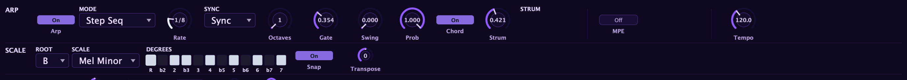

The **arpeggiator** turns held notes into patterns: multiple modes, scale
awareness, an interval grid (octaves, chords, harmonizers, diatonic triads), and a
rhythm layer with swing, probability, and Euclidean fill. It has a chord mode with
strum, and doubles as a modulation source and a set of modulation destinations.

Hold a chord, press play, and the arp turns it into a rhythmic stream of notes. The defaults are
simple (up, in time, one octave), so you can reach for depth only when you want it. The
[step sequencer (Grid mode)](/performance/step-sequencer/) shares this same clock and rhythm
engine; the [note editor](/performance/note-editor/) is where you program a fixed pitch pattern
(Grid) or a free-timeline clip (Free).

## Modes and direction

Five modes decide how Aconite walks the notes you hold:

| Mode | What it does |
|------|-------------|
| **Up** | Ascending through your held notes |
| **Down** | Descending |
| **Up-Down** | Up then back down |
| **Random** | A shuffled order, consistent within a pass |
| **As Played** | The order you pressed the keys |

**Octaves** (1 to 4) extends the pattern upward by whole octaves, so a two-note hold at Octaves 3
becomes a six-step pattern that spans three registers.

## Rate and gate

**Rate** runs in two modes:

- **Sync**: tempo-locked to your DAW, subdivided by the value you choose (eighth notes, sixteenth notes, dotted values, and so on).
- **Free**: an absolute speed in steps per second, independent of any clock, so a pattern floats on its own.

**Gate** controls how much of each step the note actually sounds. A short Gate chops notes into
staccato hits; a full Gate plays each note into the next for a legato feel.

**Latch** is the arp's live-playing trick: engage Latch mode, play a chord, and the arp keeps
cycling after you lift your fingers. Tap a new root note to shift the whole pattern: useful for
bass arps you want to play both hands free.

## Scale awareness: stay in key

Give the arp a musical key and it keeps every note legal.

- **Root** and **Scale** set the key. The scale menu covers Chromatic, Major, Minor, the modes
  (Dorian, Phrygian, Lydian, Mixolydian, Locrian), Harmonic Minor, Melodic Minor, Major and Minor
  Pentatonic, Blues, and Whole Tone, plus a set of exotic and symmetric scales, and a fully editable
  **Custom** mask. The exotic and symmetric scales, sitting just before Custom, are:
  - **Phrygian Dom** — a flamenco / Middle-Eastern colour (the fifth mode of harmonic minor).
  - **Hungarian Min** — cinematic, with two augmented seconds (harmonic minor with a raised fourth).
  - **Lydian Dom** — a bright "overtone" or acoustic scale.
  - **Hirajoshi** — a Japanese koto pentatonic.
  - **Augmented** — a six-note symmetric scale alternating minor thirds and half steps (a Whole Tone sibling).
  - **Dim H-W** — an eight-note symmetric half-whole diminished scale that plays over a dominant 7♭9.
  - **Dim W-H** — an eight-note symmetric whole-half diminished scale.
- **Snap to key** pulls any out-of-key note to the nearest scale tone, so nothing plays wrong even
  when you are scrambling for chords live.
- **Scale-walk modes** (Scale Up / Scale Down / Scale Up-Down) turn the lowest held note into the
  start of a melodic run through the scale. Hold one key for a scale run; hold a chord to set where
  the walk begins.
- **Transpose** shifts the whole pattern by scale **degrees**, not raw semitones: a "+2" stays
  diatonic wherever you are. Because Transpose is a modulation destination, an LFO or macro can
  sweep it for automatic chord progressions without ever leaving the key.

## The interval set

One grid of 13 cells decides which intervals stack from the notes you hold. The scale says which
notes are legal; the interval grid says which intervals to actively build.

Each interval has two switches:

- **Unit**: **Degree** follows the scale, so a "third" is whatever major or minor quality that
  scale degree produces. **Semitone** is an exact interval, which can step outside the key; pair it
  with Snap to pull it back.
- **From**: **Held** stacks the interval on every note in your chord for dense clusters that follow
  the voicing. **Root** stacks on the lowest held note only, so a single key gives a defined voicing
  that transposes cleanly as you move.

One grid covers three jobs at once: stacking octaves (exactly what the Octaves control does), adding
harmonizer voices above a held chord, and building diatonic triads from a single key; degrees 1, 3,
5 From Root give you an arpeggiated in-key triad anywhere you play.

The interval grid applies to the held-note modes. Scale-walk modes and Grid mode carry
their own pitch models, so the grid hides itself when it does not apply.

## Rhythm: swing, probability, Euclidean fill

A shared rhythm layer shapes the timing across every mode:

- **Swing** delays the off-beat steps for groove.
- **Probability** sets the per-step chance a step fires; a failed roll leaves a rest, thinning the
  pattern naturally.
- **Euclidean fill** spreads a set number of hits evenly across a cycle of steps: 3 hits in 8 gives
  the tresillo, 5 in 8 gives the cinquillo. Setting the cycle length differently from the pattern
  length produces polymeter.

Probability and Euclidean fill decide *whether* a step sounds; Swing decides *when*.

These gates are independent — a step fires only if it passes the Probability roll **and** lands on a
Euclidean hit slot. In Grid mode the master Probability goes further: it *multiplies* each step's own
Chance, and a Conditional trig adds a third gate, so a step sounds only when all of them pass. See the
[step sequencer](/performance/step-sequencer/) for how the full stack works together.

## Chord mode and strum

**Chord** flips the arp from one-note-at-a-time to firing the whole note pool together on each
step: same held notes, interval set, and scale-snap, played as a rhythmic chord stab. The same
clock, gate, swing, probability, and Euclidean fill drive it.

**Strum** spreads those chord notes across time:

- **Time** is the spread amount. In Sync mode it is a fraction of the step, so the strum tightens as
  you speed up, the way a real strummed chord behaves. In Free mode it is an absolute time in
  milliseconds. The gate automatically extends to cover a wide strum, so the tail of a slow strum
  is never cut short.
- **Direction**: Up (low to high), Down (high to low), Up-Down (alternates each step), As Played,
  or Random (a fresh shuffle each step).

Strum Time is a modulation destination, so a slow LFO can breathe the chord wider and tighter over
time. Chord mode applies to the held-note modes; Grid mode keeps its own pitch model.

To play a whole chord *progression* under the arp from one held key, rather than
stabbing a single held chord, see the [chord lane](/performance/chord-lane/).

When Chord mode is active, Aconite automatically switches to polyphonic voicing so the full note
stack rings together, even if the patch was previously set to a mono mode.

## The arp as a modulator

The arp exposes live data as modulation sources you can route through the
[modulation matrix](/modulation/matrix/):

- **Arp Step**: the pattern position, a staircase that advances with the clock. Route it to filter
  cutoff for a rhythmic filter sweep that tracks the pattern.
- **Arp Velocity**: the velocity of the current note, carrying any accents you have set.
- **Arp Gate**: high while a note sounds, low between notes. Route it to any parameter for a
  pulsing modulation that breathes with the rhythm.

And the arp takes modulation *in* from the same matrix:

- **Arp Root**: automate the key centre with an LFO to drift the pattern through keys over time.
- **Arp Transpose**: move the pattern diatonically from another source for programmatic chord
  progressions.
- **Arp Strum**: automate strum width for evolving, organic chord attacks.

:::tip
For a quick expressive patch: set the arp to Up, route **Arp Gate** to filter cutoff, and push
the filter envelope amount up. Every arp note plucks the filter open, then lets it settle:
a classic two-handed feel from one held chord.
:::
