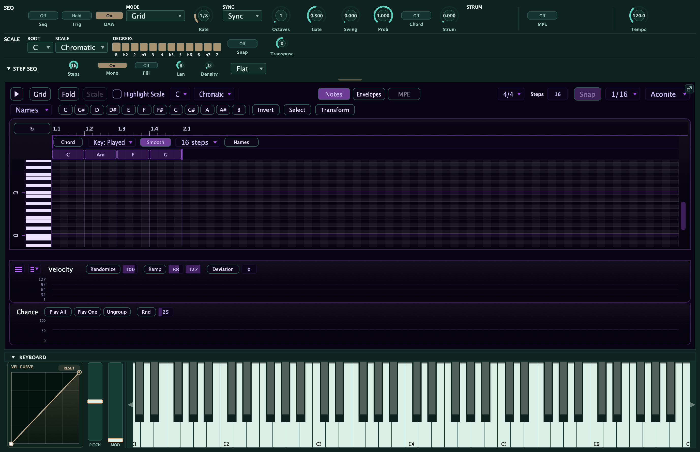
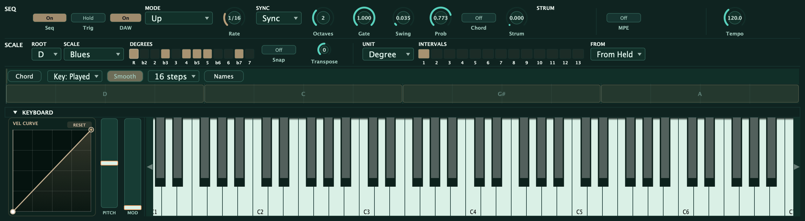

The **chord lane** lets you play a whole chord progression under the arp from a
single held key. Instead of holding a four-note chord and letting the arp walk it,
you draw a row of chord blocks (a I–vi–IV–V, say) and hold *one* note: the lane
supplies the chords, and the arp plays through each one in turn as the progression
cycles. Hold a different note and the whole progression transposes and stays in key.
It shares the [arpeggiator](/performance/arpeggiator/) clock and rhythm engine, so
everything you already know about rate, gate, swing, and probability still applies.

The lane is **relative-diatonic**: you write the progression in scale degrees, not
fixed pitches, so it follows both the key you set and the note you play. It is also
**polymetric**: give the lane its own loop length and it re-colours your pattern as
the two cycles drift against each other. One held key becomes an evolving, composed
performance.

## Turning it on

The chord lane starts off, so existing patches sound exactly as before. Two things
control it:

- The **Chord** toggle switches the harmony on and off. When it is off, the arp
  plays from the keys you hold, as usual. Turning it off **mutes the lane without
  deleting your chords**: they stay drawn, ready to switch back on.
- The sequencer **mode** decides *where you see the lane*. In **Grid** mode the
  chord blocks appear as a band pinned directly above the note grid (shown above),
  co-scrolling with it. In the pool-walking order modes (Up, Down, Up-Down, Random,
  As Played), where there is no note grid to align to, the lane appears as a compact
  **docked strip** instead.

Both presentations edit the same progression with the same controls: only the layout
differs.

## How the chords play

What the lane does depends on the arp mode:

- **In the order modes** (Up, Down, Up-Down, Random, As Played) the arp walks the
  *current chord's tones* instead of the notes you hold. As the progression advances,
  the pool of notes the arp is cycling swaps to the next chord. In a mono voice this
  gives you an arpeggiated line that follows the changes; in a poly voice the chord
  tones can ring together.
- **In Grid mode** the chord lane turns your drawn step pattern into a
  **chord-arpeggiator**: each step's degree indexes the *current* chord's tones by
  **function** (degree 1 = the root, 2 = the 3rd, 3 = the 5th, 4 = the 7th, and so on), so
  the pattern arpeggiates each chord for real — **quality comes through**. The same drawn
  1-2-3 plays a minor third over a minor chord and a major third over a major chord.
  Degree 1 is always the **root**, so a note you drew on the root stays put no matter the
  scale — the chord's **voicing** (inversion, drop-2, open, slash bass) shapes how the
  chord *sounds* in the Chord/Sustained output modes, but it never changes which tone a
  Grid degree plays. Your rhythm and contour stay put; harmony follows the changes, and
  the two run on their own cycles so the pattern keeps evolving.
  - **Reach** (in the chord header) sets what a step drawn *above* the chord's own notes
    does. **Extended** (default) keeps stacking thirds into tensions — the **7th, 9th,
    11th, 13th** — so drawing higher builds genuine extended voicings; it's a real
    extended-harmony writing tool. **Octaves** repeats the chord tones an octave up
    instead, for a strict arpeggiator (basslines, classic arp runs).
  - **Reading the rows:** with the chord lane on, switch the roll's left-edge labels to
    **Intervals** and each row is named by its function in the current chord — **R, 3, 5,
    7** for the chord tones (shown brighter) and **9, 11, 13** (with ♭/♯ variants) for the
    tensions above them. So you can see at a glance that a row is "the 9th" while you draw.
    The labels follow the chord under the playhead as the progression moves.
  - (Want free scale/passing tones instead? Turn the chord lane off — the step grid goes
    back to plain scale degrees. Want fixed pitches? Use Free mode.)

Either way, the scale keeps everything in key: chord tones are the strong notes, and
any passing or extension notes stay legal.

## Output: walk, stab, or hold

The **Output** selector in the chord header decides how the current chord actually
voices, so one row of chords can be a walked line, a rhythmic stab, or a held pad
without redrawing anything:

- **Arp** (default) — the progression re-colours the notes the arp walks, exactly as
  above. *Use it for* evolving arpeggiated lines that follow the changes.
- **Chord** — the whole voiced chord is **stabbed on every step**, so the progression
  plays as rhythmic block chords in time with the arp. *Use it for* stabbed comps,
  chord-stab basslines, and rhythmic pads.
- **Sustained** — each chord is **held as a pad** and only re-voices when the
  progression moves to the next block. Notes shared between two chords ring straight
  through the change, so it sounds like a real player holding common tones. *Use it
  for* smooth held pads and connected comping.

**Chord and Sustained switch you to a polyphonic voice automatically** so the stack
can ring (a small **P** appears on the selector as a reminder). Leave the synth where
it is; the lane handles it.

## Chord Rate: how fast the chords change

By default the progression advances one step at a time with the arp. **Chord Rate**
lets the chords change *slower* than the arp plays notes: set it to **2, 3, 4, 6, 8,
or 16 Steps** and each chord holds for that many arp steps before moving on.

:::tip
**Fast arp + slow Chord Rate = instant comping.** Set a quick arp rate for busy
movement, then set Chord Rate to hold each chord for a bar or two. In **Sustained**
output you get a lush pad that changes chord every bar while the arp keeps ticking;
in **Chord** output the Chord Rate becomes your stab grid.
:::

## Editing chords

The chord blocks behave like notes. **Drag a block's body to move it**, drag its
**right edge to resize it**, and click empty space to add a new one. Blocks never
overlap: drawing over a neighbour trims it, so only one chord is active at a time. A
**gap between blocks is silence** (no chord covers that time, so nothing sounds).

**Click a block to open its picker**, where you build the chord:

- **Degree** sets the chord's root as a scale degree (I through vii), so it stays
  relative to the key.
- **Quality** picks the chord type. Left on **Auto** it derives the correct diatonic
  triad for that degree in the current scale (so no theory is required), or you can
  choose an explicit quality (major, minor, seventh, major seventh, minor seventh,
  sus2, sus4, diminished, add9, sixth) for a specific colour.
- **Accidental** (flat / natural / sharp) shifts the chord's root a semitone for
  borrowed chords.
- **Octave** moves the whole chord up or down a register.

Below the identity controls is the **voicing** section, which rearranges the chord's
own tones after they resolve, so a voiced chord still transposes with the key:

- **Inversion** (root, first, second, third) and **spread** (close, drop-2, drop-3,
  open) reshape the stack.
- **Slash bass** places any chord tone in the bass, so you can write a `C/E` or
  `C/G` that the label reflects automatically.
- A **per-tone strip** lets you nudge an individual voice up or down an octave,
  **omit** a tone (drop the fifth, say), or **double** one (double the root).
- A **mini-keyboard preview** lights up the exact notes the current voicing produces,
  so you can see the chord before you hear it.

## The lane controls

The lane-level controls sit in the chord band's header (in both presentations):

- **Output** chooses **Arp**, **Chord**, or **Sustained** — walk the chord's tones,
  stab the whole chord, or hold it as a pad (see *Output* above).
- **Chord Rate** sets how many arp steps a chord holds before the progression advances
  (see *Chord Rate* above).
- **Key source** decides the key centre. **Played** follows the lowest note you hold,
  so the whole progression transposes as you play (the performance trick). **Fixed**
  pins the progression to a set key for fixed-song work.
- **Voice-Lead: Smooth** picks each chord's inversion to minimise the pitch movement
  from the previous chord, turning a run of root-position chords into a connected,
  composed progression. This is the single biggest polish lever; leave it off for
  strict root-position voicings.
- **Loop length** sets how many steps the lane runs before it repeats. Set it
  different from the arp's pattern length and the two cycles drift, producing
  **polymeter**: the same pattern re-colours over several bars before it lines up
  again. Repeated tiles of the lane are dimmed so you can read its loop against the
  grid.
- **Names / Roman** switches the block labels between the sounding chord name (`C`,
  `Am`, `B♭`, `C/G`), which updates live as you transpose, and Roman-degree labels
  (`I`, `vi`, `♭VII`).

## Chord-tone velocity

Velocity depends on context, because the chord lane and the step grid never play the
same notes:

- In the **order modes** and the **Chord** / **Sustained** outputs, the chord lane plays
  the notes, so each block carries **its own velocity**. **Right-drag a block up and down**
  in the docked chord strip: the top of the band is loudest, the bottom is quietest, and the
  block's fill height shows it. **Double right-click** a block to clear it back to **auto**.
- In **Grid** mode the chords only re-pitch your drawn step pattern, so the **step
  velocity lane** owns velocity there — your programmed dynamics carry straight through the
  re-harmonisation, and there's no separate chord-velocity control to fight with.

A block left on **auto** falls back to the **Chord Velocity** setting:

- **Held-key** uses the velocity of the note you play, so your dynamics carry through
  the transposer: play softer and the whole progression plays softer.
- **Fixed** plays every chord tone at one set level, for an even, mechanical feel.

In Grid mode the re-harmonized pattern uses **each step's own velocity** from the
step lane, so the accents and dynamics you drew into the pattern are preserved as it
follows the chords.

:::tip
For an instant evolving performance: draw a I–vi–IV–V, set the arp to Up, turn the
**Chord** toggle on, switch **Voice-Lead** to Smooth, and give the lane a loop length
that differs from your pattern length. Hold one key and the progression cycles,
re-colouring itself as the two clocks drift; move your held key and the whole thing
transposes and stays in key.
:::
