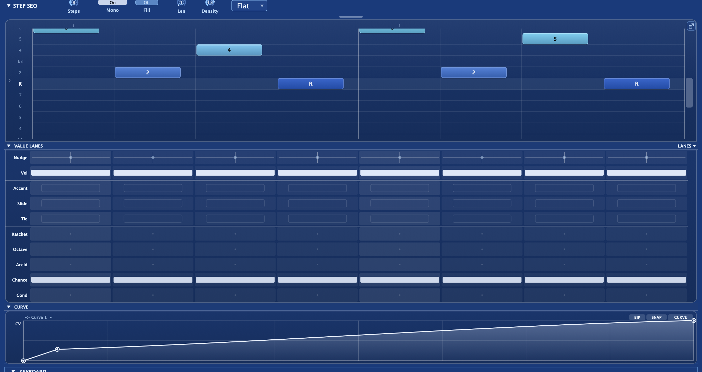

**Grid** is the step-sequencer mode of the [note editor](/performance/note-editor/):
a degree-relative, in-key note grid. Each step carries its own fields (octave,
accent, velocity, slide, tie, ratchet, nudge, chance, and conditional triggers)
alongside the per-note value lanes. It plays notes and, like the arp, doubles as a
modulation source.

Set the Seq mode to **Grid** and the panel grows to show the step editor. Grid mode
is a mode of the arpeggiator, so it inherits the arp's clock, rate, gate, Latch, the
scale foundation (Root, Scale, Snap, and diatonic Transpose), and the rhythm layer
(Swing, Probability, Euclidean fill). See the
[arpeggiator](/performance/arpeggiator/) for that shared machinery, and the
[note editor](/performance/note-editor/) for the transport, tabs, and Roll looks
that Grid shares with the piano roll.

## How the pitch grid works

The step sequencer is not a piano roll; it is a **degree grid**. Each cell in a step
column represents a scale degree relative to the note you hold. Degree 1 is the
root, degree 2 is a step up the scale, and so on. Because the pitch is always
relative, the whole pattern transposes and stays in key the moment you change the
held root. You literally cannot play a wrong note.

Each step plays a single note or a chord: light one degree cell for a mono line,
stack several for a sequenced chord. Extra held notes are ignored; the lowest held
note is the root.

## Per-step fields

Each step carries a full set of controls:

| Field | What it does |
|-------|-------------|
| **Degrees** | The scale degree(s) this step plays: one note or a stacked chord |
| **Octave** | Register shift (−2 to +2): reach below the root without a taller grid |
| **Accidental** | A one-semitone nudge: the one chromatic escape from the scale, for approach notes |
| **Accent** | Lifts the velocity toward full for the emphasized hits |
| **Velocity** | The step's base loudness before accent |
| **Slide** | Glides into the next step: the 303 legato portamento |
| **Tie** | Holds the previous note through this step as one continuous note |
| **Ratchet** | Retriggers the step 1–8 times across its slot (rolls and stutters) |
| **Nudge** | Per-step micro-timing: shift this step's onset early or late |
| **Chance** | Per-step play probability, multiplying the global Probability |
| **Cond** | A conditional trigger: the step only fires when its condition is met |

A rest advances the clock but plays nothing. **Steps** sets how many cells play (see
[clip length](/performance/note-editor/#clip-length-len-and-steps)).

Patterns travel with presets, so a bassline you save comes back with the sound.

## Slide and tie: the 303 legato feel

Slide and tie each give the line a different kind of continuity.

A **slide** step glides into the next note instead of retriggering, the classic 303
portamento bend. For the glide to actually bend the pitch, turn **Glide** up in the
[voicing controls](/performance/voice-and-play/). Keep Mono on (its default) so
slides collapse to a single legato voice.

A **tie** holds the previous note through the step with no re-attack, turning a run
of tied steps into one sustained note.

For an acid bassline: set Mono on, set Glide, dot a few slide cells, add octave pops
and an accidental for approach notes. The filter does the rest.

## Ratchet roll dynamics

A ratcheted step fires its note evenly across the slot for rolls and stutters. Each
hit follows a **Shape** you choose:

- **Flat**: every hit the same level.
- **Up**: crescendo to full.
- **Down**: descrescendo from full.
- **Up-Down**: swells to a peak and back.
- **Random**: a stable per-loop shuffle that repeats identically each pass.

The roll's mini-blocks in the grid visually match the shape, so what you see matches
what plays.

## Chance vs Conditional — the two per-step gates

Chance and Conditional are both "does this step fire?" gates, and they're easy to
confuse. The distinction that matters: **Chance is random, Conditional is
deterministic.**

| | **Chance** | **Conditional** |
|---|---|---|
| Behaviour | Rolls a die every cycle — fires about N% of the time | Repeats identically — a fixed rule on the pattern pass |
| Value | 0–100% probability | A trig condition (1:2, 2:2, 1:3 … 1:8, FILL/!FIL, PRE/!PRE, 1ST/!1ST) |
| Repeatable? | No — different every loop | Yes — the same every loop |
| Scope | Per **note** (each chord tone rolls its own) | Per **step** (gates the whole step) |
| Reach for it when | Humanising, thinning, "sometimes" hits | Fills, every-other-bar variation, ghost chains |
| Editing | Drag lane (plus Play All / Play One groups) | Click-to-menu cell |

**They combine (AND):** a step fires only if it passes *both* its Chance roll *and* its
Conditional (and the Euclidean fill, and the global Probability). So 1:2 + 60% Chance =
every other pass, and then 60% of those. The classic pairing is Chance on one step plus
**PRE** on the next, for dependent ghost notes (described below).

## Conditional triggers

Each step can carry a **Cond** value that gates it behind a rule. A step has to pass
its Cond check, its own Chance roll, and the global Euclidean fill mask to fire. The
condition families are:

- **Loop ratios**: the step plays on a chosen loop out of every few passes. An
  **X:Y** ratio reads as *the Xth loop of every Y*, so 1:2 plays on odd loops, 2:2
  on even loops, and 1:4 only every fourth time through. The full set runs through
  all :2, :3, and :4 combinations, plus sparse long-cycle ratios: **1:6** surfaces
  the step once every six loops and **1:8** once every eight, useful for a fill note
  that appears only rarely, or a slow evolution that takes eight bars to complete.
  Different steps on different ratios cause the pattern to rewrite itself over
  several bars.
- **FILL / !FILL**: the step fires only while the momentary Fill control is held
  (FILL), or only while it is not (!FILL). Dot extra hits with FILL and they wait
  until you hold Fill; mark the main groove !FILL and it drops out the instant you
  call the fill for breakdowns.
- **PRE / !PRE**: fires only if the previous conditional step did (PRE), or only if
  it did not (!PRE). With PRE, each pass yields one of three outcomes: neither step,
  the main step alone, or both together, but never the second step without the
  first. This creates dependent probability: a ghost note that only shadows its
  parent, so the pair reads as one musical gesture that either happens or does not.
  **!PRE** inverts that relationship: the second step becomes a call-and-response
  that only fills in when the first drops out.
- **1ST / !1ST**: fires on the first pass only (1ST), or on every pass but the first
  (!1ST). Use it for a pickup that never repeats, or an answer that only arrives
  after the pattern loops.

Stacked with Chance and Euclidean fill, conditional triggers turn a static grid into
an evolving, generative pattern that keeps surprising you.

## Euclidean fill

Euclidean fill lays a rhythmic mask over the whole pattern without changing any
pitches. Set a cycle **Length** and a **Density** (number of hits to place inside
that cycle) and the engine spaces those hits as evenly as possible: 3 hits in 8
gives the tresillo, 5 in 8 the cinquillo. Setting the cycle length differently from
the pattern length creates polymeter, so the rhythm accent rolls through the bar.

## Per-note focus: editing a voice in a chord

A step can hold a chord, so the three expressive lanes (**Velocity**, **Accent**,
and **Chance**) edit **one voice at a time** rather than the whole step. Click any
note block to **focus** that voice for editing. When a voice is focused, its whole
row washes with a highlight band, its blocks gain an accent ring, and its row label
turns bold, so you can see exactly which degree you are editing. A small **"editing:
&lt;degree&gt;"** indicator on the value-lane strip names the focused voice as an
interval relative to the root.

With a voice focused, the Velocity, Accent, and Chance lanes read and write that
voice across the whole pattern. Steps that hold the focused degree show its values;
steps that do not read blank and ignore edits. This lets you set a louder top note
across every chord, accent one inner voice without touching the others, or give a
single voice a lower play chance for generative variation.

The other lanes (Nudge, Slide, Tie, Ratchet, and Cond) always edit the whole step.
Focus is a live editing state and is not saved with the pattern. When no voice is
focused, the per-note lanes default to each step's primary (lowest) voice, which for
a mono line is always the only note, so focus only matters once steps hold chords.

## The scale editor

The Keys scale row includes a per-degree toggle for each scale degree. Click a
degree to turn it off; the scale switches to **Custom** and that degree's row
disappears from the grid, removing those pitches from the pattern's vocabulary. Use
it to sculpt a scale that only contains the degrees you want, from a pentatonic
subset right down to a two-note drone grid. Turning a degree back on restores its row
with the remaining degrees still set.

## Grid as a modulator

Because Grid is a mode of the arp, it exposes the same live data as modulation
sources you can route through the [modulation matrix](/modulation/matrix/): the
pattern position (a staircase that advances with the clock), the current step's
velocity, and a gate that goes high while a note sounds. Route the step position to
filter cutoff for a rhythmic sweep that tracks the pattern.

For pattern-synced modulation you draw yourself, use the
[Envelopes tab](/performance/seq-envelopes/): pick any destination and draw a curve
that plays in sync with the pattern.

:::tip
A good starting trick: on the Envelopes tab, draw a slow-rising ramp onto filter
cutoff and unlink it to a four-bar loop. The filter sweeps open over four full
pattern passes, then resets: an automatic build that you never have to touch.
:::
