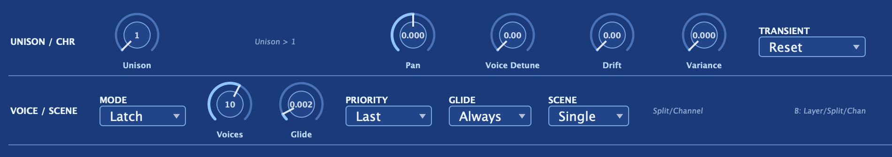

The voicing section decides how notes become sounding voices: up to 16-voice
**polyphony**, five **play modes** (Poly / Duo / Mono / Legato / Latch) with note
priority and glide, **unison** stacking (count / detune / spread), and the
analog-character controls — **Voice Detune, Drift, Variance, and Transient** — that
loosen voices away from perfect digital precision for an "alive" sound.

## Polyphony

The **Voices** control sets the polyphony cap from 1 to 16. When every allotted voice is busy, a
new note steals the oldest. The effective cap follows the play mode and unison count — mono modes
and heavy unison stacks fold down to fewer sounding notes automatically.

## Play modes

Five modes decide how held keys become sounding voices:

| Mode | What it does |
|------|-------------|
| **Poly** | Full polyphony — every key sounds its own voice |
| **Duo** | Two-voice polyphony |
| **Mono** | A single sounding voice; each new note retriggers the envelopes |
| **Legato** | A single voice that glides to each new note without retriggering, so envelopes keep running |
| **Latch** | A single held note that new notes replace, and that keeps sounding after you lift the key |

With the arpeggiator on, **Latch** becomes arp hold: the chord keeps cycling after you release the
keys, and a fresh press with no keys down replaces the latched chord.

### Note priority

In mono modes, the sounding note is chosen by priority:

- **Last** — the most recently pressed key.
- **Highest** — the highest held key.
- **Lowest** — the lowest held key.

## Glide

Glide slides the pitch from the previous note to the new one over a settable time. Two modes:

- **Always** — glide happens on every note, regardless of whether keys overlap.
- **Fingered** — glide only happens between overlapping notes. A fresh note after all keys are
  released snaps cleanly to pitch, so you can shape legato passages without glide following you
  everywhere.

A whole chord glides from the previous note cleanly, without each voice smearing its own start.

For slide steps in the step sequencer, Glide has to be non-zero for the slide to actually bend
pitch. See the [step sequencer](/aconite-manual/performance/step-sequencer/) for details.

## Unison

**Unison** stacks up to eight voices per note. Two controls shape the stack:

- **Detune** — spreads the stacked voices in pitch, on top of any base detune. Because each stacked
  voice carries its own stable offset, the stack fattens into a wide, slowly beating cloud rather
  than a chorus that pulses in lockstep.
- **Spread** — pans the stacked voices across the stereo field.

At Unison 1 there is no stacking — Detune and Spread have no effect. Turn Unison up and Detune up
together for the classic "megasaw" texture; add Spread for width.

## Analog character: the aliveness layer

Four controls loosen each voice away from perfectly matched digital precision, modeling the way
separate analog voice cards each have their own personality. At zero every voice collapses to
identical. Higher settings model older, looser hardware.

- **Voice Detune** — a fixed per-voice pitch spread across the stack. Even a small amount makes a
  chord shimmer and feel live rather than static.
- **Drift** — slow, quasi-random per-voice pitch wander that keeps the tone moving over time.
- **Variance** — one knob that adds per-voice slop to cutoff, envelope times, pulse width, and glide
  time simultaneously. Push it up and the synth starts to feel like individual analog voice cards
  that each have their own character.
- **Transient** — two settings. **Analog** leaves oscillator phase and filter state running when a
  voice is stolen and reused, for a punchy, varying attack. **Reset** zeroes them at each note-on
  for a consistent, clicky attack. Transient governs the DSP state reset only — it is separate from
  **Env Restart**, which controls the envelope's starting level when a new note arrives.

The analog-character controls are what the philosophy chapter describes as "aliveness." See
[The Aconite philosophy](/aconite-manual/getting-started/philosophy/) for the broader framing of why
these exist.

## Velocity curve

The **velocity curve** is a drawable map that reshapes how hard you play into the velocity the synth
actually uses. It sits in the performance area alongside the pitch and mod wheels.

The horizontal axis is the velocity you play; the vertical axis is the velocity Aconite receives.
The default is a straight diagonal — a 1:1 pass-through. Bending the line away from the diagonal
changes the response:

- **Soften** — flatten the upper end so hard playing lands gentler, for a more forgiving touch.
- **Harden** — steepen it so subtle differences in strike force become dramatic dynamic swings.
- **Compress** — pull the whole range into a narrow band, so loud and soft notes sit close together.
- **Expand** — push the extremes apart, widening the gap between your softest and hardest playing.
- **Fix** — a flat horizontal line for one constant velocity regardless of how hard you play.
- **Reverse** — slope it downward so soft playing is loud and hard playing is soft.
- **Freehand** — draw any contour; the curve follows exactly what you draw.

Because the curve reshapes velocity before anything reads it, it moves everything velocity drives at
once: note loudness and every velocity-based route in the
[modulation matrix](/aconite-manual/modulation/matrix/) respond to the same drawn shape. It also
feeds the arpeggiator and step sequencer, so their accents ride the reshaped velocity too.

A live indicator dot shows where your last played note landed on the curve, so you can see your
touch mapping as you play. A reset returns the curve to the straight linear default at any time.

## Pitch-bend range

The pitch-bend range controls how many semitones the pitch wheel reaches at full throw. The standard
is two semitones; wider ranges suit expressive lead playing or trombone-style glides.

When MPE is active, each voice tracks per-note bend from its own MIDI channel, and the per-note
pitch-bend range is adjustable from 1 to 96 semitones — 48 semitones by default, to suit expressive
controllers. Per-note pressure and vertical slide are exposed to the modulation matrix as the sources
**MPE Press** and **MPE Slide**, so you can route them to any destination — filter cutoff, timbre,
volume, or anything else in the matrix — for fully independent expression on every finger.

## Panning

Two pan controls are available:

- **Voice Pan** — places the overall voice output in the stereo field. Because this follows the
  modulation matrix Pan destination, an LFO or other source can auto-pan on top of the static setting.
- **Scene Pan** — places a whole scene in the field when Layer or Split mode is active.

## Panic

A **PANIC** button is always visible in the header. One click instantly silences everything — stops
all notes, kills any stuck or hung voices across both scenes, clears held and latch state, and
flushes the effect bus so ringing reverb and delay tails go quiet. Use it any time a note will not
release or a patch runs away on you.

## Quality and CPU

The oversampling Quality setting and the Auto HQ on bounce option live in the
[Master band](/aconite-manual/master/master-band/). For a full explanation of Quality levels and
CPU tradeoffs, see [Performance & CPU](/aconite-manual/reference/performance/).

:::tip
For thick pads: set Poly to 6–8 voices, nudge Voice Detune to about 10–15%, add a little Drift,
and set Variance to taste. The result sits between "digital precise" and "vintage unstable" — the
sweet spot that makes a chord feel alive without going out of tune.
:::
