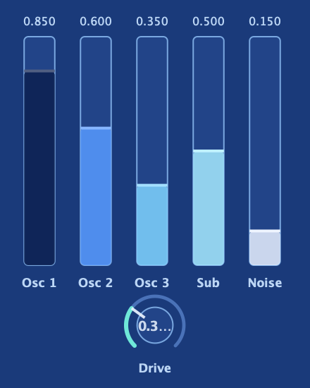

The **mixer** sets the level of each source before the filter, in the classic
Minimoog style, and adds **Mix Drive**, a per-voice overdrive that fattens and
saturates each playing voice's combined signal as you push it, giving you dirt
before the filter even touches it. Because it runs per-voice rather than on a
shared bus, chords saturate more three-dimensionally: each voice's harmonics are
generated independently, so the result never collapses into a single smeared
distortion cloud.

## The five faders

The mixer has a fader for each sound source. All five run simultaneously; this is
not a crossfade or an either-or selection:

| Fader | What it controls |
|-------|-----------------|
| **Osc 1** | Level of oscillator 1 into the mix. |
| **Osc 2** | Level of oscillator 2 into the mix. |
| **Osc 3** | Level of oscillator 3 into the mix. |
| **Sub** | Level of the [sub oscillator](/sources/sub-noise/). |
| **Noise** | Level of the [noise source](/sources/sub-noise/). |

Because the sources are independent faders (not a crossfade), any combination can
be active at once. You can run all three oscillators at full level, or bring in
just a whisper of noise, or silence Osc 2 entirely while Osc 1 and 3 play.

:::note
The mixer is **per-scene**. The faders, mutes, per-source odds, and Mix Drive all follow the
**Edit: Scene A / B** selector, so each [scene](/performance/scenes/) can hold a completely different
source balance. The **RESO** return channel (below) is the one exception: it is shared, since it rides
the combined master bus.
:::

## Normalize levels (right-click)

**Right-click the mixer background** (the empty space around the faders, not a fader
itself) for **Normalize levels**. It brings your mix up to full headroom without
changing the balance: it scales every un-muted source by the same factor so the
loudest one reaches the top of its fader, and the rest keep their exact proportions.
Dial in a blend you like at low levels, then normalize it in one click to make it as
loud as it can be.

Muted sources and sources sitting at zero are left where they are — only the audible
ones are scaled — and it does nothing if the loudest source is already at full or the
whole mix is effectively silent.

:::note
Right-clicking a *fader* opens its **Modulate / MIDI-learn** menu instead. Normalize
lives on the background so it does not compete with the per-fader menu.
:::

## Per-source Probability (the odds chip)

Each of the five sources carries a small **odds chip** showing a percentage: the
**chance that source sounds on a given note**. At **100%** (the default) the source
plays every note, so a normal patch is unchanged. Lower it and that source starts to
drop out at random from note to note: set Osc 3 to 60% and it speaks on roughly six
notes in ten while the others play through.

Each source rolls its own independent dice, so the sources come and go in ever-shifting
combinations rather than in lockstep. It is the fastest way to make a static stack of
oscillators feel alive and generative: dial back the odds on a layer or two and hold a
pattern, and the timbre keeps rearranging itself without ever repeating exactly.

The odds are also [modulation matrix](/modulation/matrix/) destinations, one per source:
**Osc 1 Probability, Osc 2 Probability, Osc 3 Probability, Sub Probability,** and **Noise Probability**. Sweep a
source's odds with an LFO or envelope to fade a layer from "always there" to "rare
sparkle" hands-free.

This is the same [Probability](/modulation/matrix/#sources) gate the modulation matrix
offers, brought right onto each fader so the odds ride the control they govern. See
[the probability features](/performance/probability-filter/) for how per-source Probability,
the matrix Probability source, and the Probability Filter fit together as one family.

When a source's Probability fires on a note you can watch it happen: its lane briefly
brightens toward the generative accent colour, and the [on-screen
keyboard](/interface/keyboard/) shows the oscillators that fired as coloured bands on
the playing key. A source left at 100% shows a plain highlight with no band.

## The RESO return channel

Set apart on the right of the mixer, past a thin divider and drawn in its own colour,
is a sixth fader labelled **RESO**. This one is not a sound source. It is the return
level of the [Sympathetic Resonator](/effects/effect-by-effect/#the-sympathetic-resonator),
brought out here so you can set how much sympathetic resonance is in the sound right at
the mix stage, alongside your source levels, instead of switching over to the resonator
panel. It is the same control as the resonator's own Amount, so moving one moves the
other.

The RESO fader also has its own **M**. Pressing it mutes the whole resonance instantly,
without moving the fader, so you can flip the resonance in and out to hear exactly what
it is adding and then bring it straight back at the level you had set. When you leave it
alone, RESO simply mirrors whatever the resonator is set to, so a patch that never uses
sympathetic resonance is completely unaffected.

## Balancing oscillators for character

A few things worth knowing when you start tweaking levels:

- **Equal levels do not mean equal loudness.** Different waveforms and models have
  different peak amplitudes. A Unison saw at 50% fader will hit the mix harder
  than a sine at the same fader position. Trust your ears over the fader positions.

- **Detuned layering interacts with the fader mix.** When two oscillators are
  slightly detuned from each other, they beat against one another, a slow volume
  pulse at low detuning, a flangey shimmer at moderate amounts. Their relative
  level in the mixer affects how prominently the beating sits in the final tone.

- **The sub fader is easy to overdo.** At high levels (especially at −2 octave
  with a square wave shape), the sub can muddy the low end and drive the pre-filter
  stage hard even before Mix Drive enters the picture. Pull it back until you feel
  the weight rather than hear the sub as a separate element.

- **All five faders are [modulation matrix](/modulation/matrix/)
  destinations**: Osc 1, Osc 2, Osc 3, Sub, and Noise. You can sweep Osc 2's
  level with an envelope for a swell, bring the noise in on an LFO for a trembling
  breath effect, or have the sub duck in and out with an envelope follower.

## Mix Drive

**Mix Drive** is an analog-style overdrive that sits between the mixer output and
the filter input. Every voice's mixed signal runs through it before anything else
in the signal path touches it, which means it colours the material that then gets
further shaped by the [filter](/filters/the-two-filters/).

At its minimum, Mix Drive is a **true bypass**: the clean signal path is completely
untouched, not just quiet. The moment you move it off zero, the drive stage engages.
As you push it:

- The low end softens and thickens slightly, rounding off peaks in a way that
  feels warm rather than harsh.
- Harmonics accumulate across the frequency range, adding grit and presence to
  the midrange.
- The top end gets a subtle edge, not a fizz, but a livening of the high
  harmonics that can make a mix cut better through other instruments.

Push it further and the effect becomes obvious: a driven, saturated quality that
lives somewhere between tape saturation and the gain stage of an overloaded mixer.
This is not a clean gain stage. It responds dynamically to the signal: louder,
more complex mixes (multiple oscillators at high levels, high sub content) saturate
more heavily than sparse signals at the same Drive setting.

:::tip
Mix Drive interacts with filter resonance. A filter with moderate Resonance and
Drive pushed up will self-resonate differently when Mix Drive is adding harmonics
upstream. Try sweeping Mix Drive with a sustained resonant patch; you will hear
the filter character shift as the input gets richer.
:::

### Mix Drive before vs after the filter

This placement (before the filter) is the key design choice. It means:

- The filter shapes the saturated signal, not the other way around. Cutoff sweeps
  through the harmonics Mix Drive added, and those harmonics behave exactly like
  oscillator harmonics do; they open and close with the filter.
- Increasing Mix Drive makes the filter response feel more dynamic and "pushed",
  because the filter is now working with a denser input signal.
- The dirt is per-voice. Each voice saturates independently, which means a chord
  does not collapse into a single smeared distortion cloud; each voice's
  harmonics are generated separately, and the result is thicker and more
  three-dimensional than a bus-level overdrive would produce.

:::caution
If you are adding Mix Drive to a patch that already has Filter Drive up, keep an
ear on the overall level as you go. The two stages stack: Mix Drive enriches the
signal going into the filter, and Filter Drive amplifies the gain into the filter's
own non-linear stage. Combined, they can move a lot of energy through the voice.
Run a note at the loudest velocity you intend to use and check the output meter
before committing to a level.
:::

### Mix Drive as a sound-design tool

Beyond "add grit", Mix Drive has a few specific applications worth trying:

- **Fattening a thin oscillator mix.** A single DCO saw at modest level is clean
  and a little thin. Push Mix Drive up and the harmonic enrichment fills the
  midrange without changing the oscillator settings, effectively giving the
  oscillator more body.

- **Overdrive that scales with dynamics.** Because Mix Drive responds to the
  amplitude of the combined oscillator mix, playing harder (with velocity routed
  to oscillator levels or Osc level in the mod matrix) drives it harder
  automatically. The distortion becomes an expressive response to how hard you
  play.

- **Pre-filter grit for physical models.** The String and Modal oscillators have
  their own internal character, but feeding them through Mix Drive before the
  filter adds a layer of saturation that can make a plucked string sound
  amplified, worn, or wiry rather than pristine.
