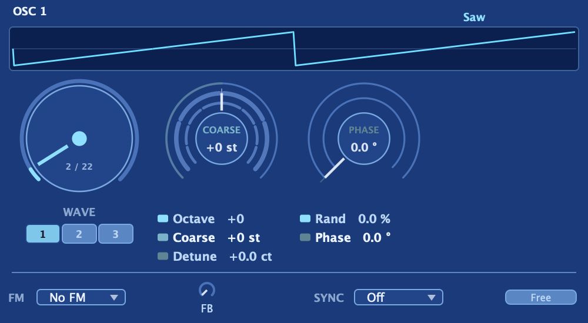
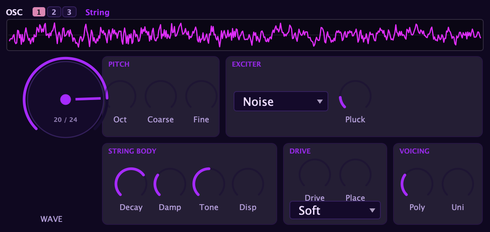
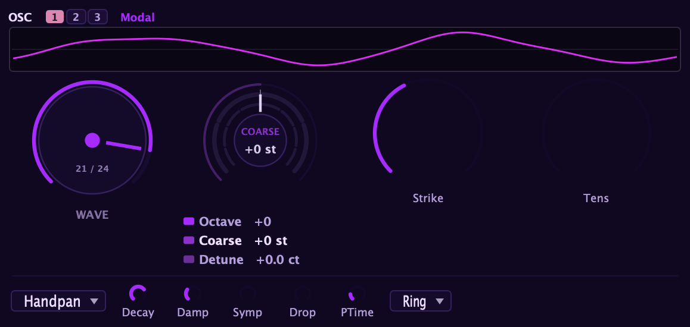
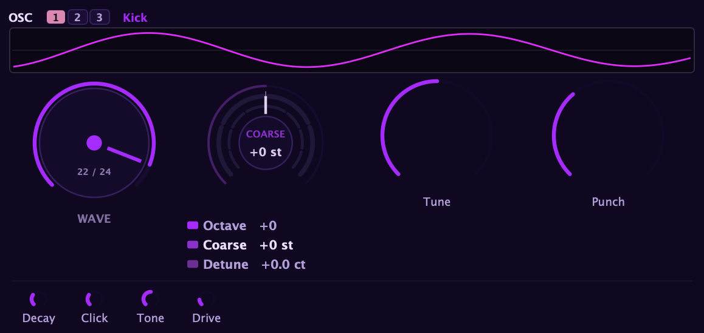
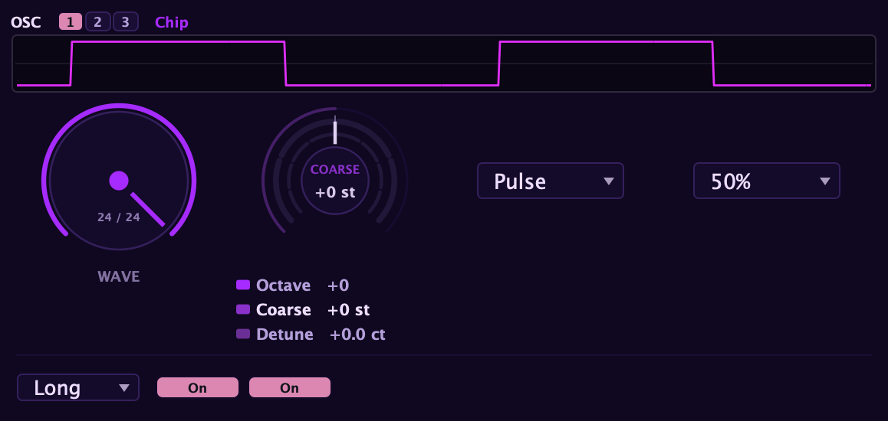

Aconite gives you three full oscillators, each built on a **Wave × Model** idea:
you pick a waveform and, independently, a model that decides how that waveform is
generated. The models span classic analog and virtual-analog, a DCO, wavetable,
the additive bank, the modeled **Acoustic** concert grand, the physical-modeling
**String**, **Modal**, and **Kick** voices, and the authentic **Chip** oscillator
(NES 2A03 and C64 SID). Each oscillator has its own
octave, coarse tune, detune, pulse width and PWM, and phase controls.

## The three oscillators share one panel

You edit all three oscillators through a single panel, switched by the **1 / 2 / 3**
selector in the panel header. Click **1**, **2**, or **3** and the panel shows that
oscillator's controls; whatever you change applies only to the oscillator you have
selected. This is how you reach oscillators 2 and 3: there is no second or third
panel to find, just click the number.

Each oscillator keeps its own waveform, model, tuning, pulse width, phase, and every
other setting on the panel. Switching the selector never disturbs the other two, so
you can dial in three completely different oscillators and flip between them to
compare or fine-tune.

## The wave and the model

One menu per oscillator selects both things at once. The waveform is the shape;
the model is the analog character applied to it. An unadorned name (**Saw**,
**Square**, **Triangle**, **Shark's-tooth**) gives you the clean, band-limited
version. A parenthesized suffix adds a layer of analog personality on top.

You can also **drag the waveform display up or down** to step through the waveform
types, exactly as if you were turning the wave selector. Hold **Shift** while
dragging for finer, one-at-a-time steps. See [How every control
works](/interface/controls/) for the shared drag and fine-adjust
behavior.

### Waveforms

**Sine**: the purest tone, a single frequency with no overtones. Useful for smooth
sub content, FM carrier sounds, and anywhere you want an almost vocal, flute-like
clarity.

**Saw**: the richest harmonic source of the classics, full of both odd and even
partials. Bright and cutting in the high register, thick and powerful lower down.
Most leads and aggressive basses start here.

**Square**: only odd harmonics, which gives it a hollow, woody, or reedy quality
depending on the filter. At 50% duty cycle it is a perfect square; narrow the
pulse width and it gets progressively thinner and nasal (this is also where pulse
width modulation (PWM) lives).

**Triangle**: a mellower sibling of the square, also odd-partial, but the
partials fall off much faster. Softer than a saw, rounder than a square: flute,
oboe, and vintage synth bass territory.

**Shark's-tooth**: a half-rectified waveform with a pronounced even-harmonic
content that sits somewhere between a saw and a sine. It has a bite and an
asymmetry that the pure classics lack; useful for plucky, percussive tones and
sounds that need both warmth and edge.

**Sine** is the only base wave without model variants. **Shark's-tooth** supports
only the **Analog** model (it does not have Unison, Silk, or DCO variants). **Saw**,
**Square**, and **Triangle** each support all four models.

### Models

**Analog**: a pitch-tracking spectral tilt that gently rounds the top end as
pitch rises, the way a real analog oscillator does. The result is warmer and a
little rounder than the clean version without being dull. A classic Minimoog-style
character.

**Unison**: seven detuned copies of the oscillator fanned around the played
pitch. The spread is massive, huge and wide and instantly recognisable as a
supersaw or super-square. Use **Detune** to open the fan; use **Mix** to balance
the centre tone against the outer voices. This model makes one oscillator sound
like an ensemble on its own.

**Silk**: a lightly corner-rounded voice modelled on a state-variable oscillator
design. Smoother and creamier than Analog, with less harmonic bite. The polite
end of the analog spectrum: good for pads, strings, and vintage polysynth tones.

**DCO**: a digitally clocked oscillator with a light analog edge. The tone is
cleaner and more stable than Analog or Silk but not sterile, alive in the way a
Juno-80 or Jupiter-8 is alive. Good for clean leads, arpeggios, and anything
where you want controlled character without unpredictability.

:::note
Selecting any model variant (Analog, Unison, Silk, or DCO) disables **pulse
width modulation**, **hard sync**, **per-sample FM**, and **operator self-FM
feedback** for that oscillator. Those features work only on the plain, unadorned
waveform entries (Saw, Square, Triangle, Shark's-tooth). If you need sync or FM
alongside an analog character, keep the relevant oscillator on its plain waveform
and layer the modelled version on a different oscillator.
:::

:::tip
You can layer all three models on the same base wave across the three oscillators.
For example: one Silk saw for warmth on Osc 1, one Unison saw for width on Osc 2,
and one DCO saw for a clean centre on Osc 3, then blend them to taste in the
[mixer](/sources/mixer/).
:::

### Special oscillators

**Wavetable**: a morphable set of up to eight frames (sine → triangle → saw →
square in the factory set). The **Position** control sweeps across the frames, and
**WT Morph** switches between **Linear** (crossfade between frames) and **Spectral**
(spectral interpolation, which blends the harmonic content rather than the waveform
shape). You can load your own wavetables via **Load WT**. When you select Wavetable,
the Pulse Width controls relabel to **Position** and **Pos Mod**, and the same
LFO-sweep behaviour applies. If you would rather build a tone from its individual
harmonics than morph through pre-made waves, see the
[Additive oscillator](/sources/additive/).

## Acoustic (modeled concert grand)

The **Acoustic** oscillator is a concert grand piano built right into the synth. It
is made by analysis-resynthesis: real grands were measured, note by note, and their
partials, amplitude contours, and air captured, then rebuilt so the oscillator can
play them back. That means it behaves like a synth oscillator, not a fixed sample. It
tracks pitch across the whole keyboard and responds to velocity musically, so playing
harder changes the timbre and not just the loudness, the way a real piano brightens
when you dig in.

An **INSTRUMENT** selector picks which grand you are playing:

- **Grand C5**: the darker, warmer of the two, a rounder studio grand.
- **Grand CF3**: brighter and more open, a full concert-grand voice.

Four character knobs re-voice whichever grand you chose, so it is a starting point you
sculpt rather than a locked patch:

- **Bright**: spectral tilt, from mellow and dark to open and present. Lifts or lowers
  the upper partials across the instrument.
- **Decay**: how long notes ring, from a short, damped tone to a long open sustain.
- **Inharm**: inharmonic character, the stretch a real piano's stiff strings give their
  partials. Turn it up for more of that piano-string bloom and stretched-octave feel.
- **Morph**: blends toward the other grand, so you can sit anywhere between the warm
  C5 and the bright CF3 rather than choosing one outright.

Because it is resynthesis rather than a sample, every one of these controls reshapes
the tone live, and the Acoustic oscillator plays through the voice's filter, amp, and
effects exactly like any other oscillator. Every knob is a
[mod-matrix](/modulation/matrix/) destination.

The three physical-model voices below (**String**, **Modal**, and **Kick**) are a
family: each one is a genuine physical model, excited at note-on and left to ring
and decay on its own, and each plays through the voice's filter, amp, and effects
exactly like any other oscillator. They are a flagship part of what Aconite can do,
so they get full treatment here.

## String (plucked and bowed string)

The **String** is a physical model of a vibrating string, not a wavetable or an
analog oscillator playing back a fixed shape. Energy is fed into the string at
note-on, and from there it rings and decays on its own, coloured by everything you
do to it. From a single resonator it plays guitar, koto, harp, clav, a fully
playable piano, and (with the Bow exciter) a singing violin, cello, or double bass.
Two behaviours it shares with real strings: harder plucks are genuinely brighter,
not just louder, and playing legato bends the still-ringing string rather than
re-plucking it, so glides sound like a guitarist sliding a finger up the neck.

The String's controls are laid out in labelled sections so the model reads like a
real instrument rather than a wall of knobs. **PITCH** holds the octave, coarse, and
fine tuning. **EXCITER** picks the front end that starts the string (below) and its
one exciter-specific knob. **STRING** shapes the string itself: Decay, Damp, Tone,
and Dispersion. **BODY** is a selectable soundboard that any exciter can drive.
**DRIVE** is the string's own saturation stage (Drive, Place, and a Drive Curve).
**VOICING** carries the "realness" controls, Poly, Uni, and Humanize.

### The Exciter: how the string is set in motion

The **Exciter** menu chooses the front end that starts the string, and it is the
single biggest character control on the model. There are five, and they are all
level-matched, so switching between them does not jump the output:

- **Noise**: a short burst of noise, the classic breathy Karplus-Strong pluck.
- **Impulse**: a short shaped click (not a lone spike), the brightest and most
  click-forward attack.
- **From Osc**: the oscillator's own waveform seeds the string, for a harmonically
  rich, more synthetic pluck.
- **Hammer**: a velocity-sensitive felt-hammer strike whose attack sharpens the
  harder you play, which is exactly what makes a piano brighter when you hit it
  harder. This is the exciter that, with a Grand body behind it, turns the String
  into a playable piano.
- **Bow**: the one exciter that does not strike. Instead of seating energy once, it
  feeds a sustained friction force into the string for as long as you hold the key,
  so the string sings into a bowed violin, cello, or bass tone that rings while held
  and stops when you release. The same resonator that plays guitar and piano becomes
  a bowed-string instrument.

### The controls

- **Tone**: pluck hardness, from a soft, round fingertip feel to a hard pick attack.
  Harder is brighter in timbre, not merely louder.
- **Pluck Position**: where along the string it is plucked, from a bridge-y, nasal
  quality to a round, full sound.
- **Decay**: overall ring time, from a short muted pluck to a long open sustain.
- **Damping**: how fast the highs fade relative to the low end, from dark and soft
  to bright and metallic.
- **Dispersion**: string stiffness, which stretches the overtones progressively
  sharp and morphs the timbre from guitar through koto and clav toward bell and
  piano. The fundamental stays in tune while the character changes underneath it.
  This is also the control behind the String's piano behaviour: on a real piano the
  strings are stiff enough that their partials stretch measurably sharp, and more so
  the higher you play, which is why a piano's top octaves are tuned deliberately sharp
  to match. Turn Dispersion up and the String reproduces that inharmonicity, the
  partials stretching sharp toward the treble exactly as a real piano's do, which is a
  large part of why a Hammer-excited String reads as a genuine piano rather than a
  plucked synth.
- **Drive** and **Place**: **Drive** is a saturation stage that colours the string
  in a level-dependent way (loud passes fold over and grit up, then mellow as the
  note decays, for sitar and distorted electric-string tones). **Place** decides
  where that grit lives: at one end the saturation sits inside the string itself, so
  the character evolves over the note; at the other end it moves to the string's
  output, like an amplifier placed after the pickup, for a cleaner and more
  aggressive edge. A single **Drive Curve** (Soft / Med / Hard) sets the fold
  hardness.
- **Poly**: dual polarisation. A real string vibrates in two planes at once, and
  those planes interfere into a two-stage decay and a gentle beating chorus, the
  single biggest "real versus synthetic" tell in a strung tone. Poly mixes in that
  second plane.
- **Unison**: true multi-string unison, the way a piano note is actually one, two,
  or three slightly detuned strings sharing one bridge. Off is a single string;
  turning it up brings in a second and then a third detuned string for the natural
  chorus and slow beating of a real strung note.
- **Humanize**: a small per-note scatter of pitch (up to about ±3 cents) and level
  (up to about ±2 dB), so repeated notes are never machine-gun identical the way a
  real player's are not. At zero it is off and the model is exact; turn it up and the
  patch stops sounding sampled and starts to breathe. It is one of the biggest "alive
  versus static" tells on a repeated line.
- **Bow Force** and **Bow Speed** (Bow exciter only): the two live bowing controls.
  **Bow Force** is pressure and dynamics: harder bowing is louder, and pressing past
  the sweet spot over-presses into a raucous scratch. **Bow Speed** is brightness and
  articulation: a faster bow gives a brighter, quicker-catching tone. Route an
  envelope to Bow Force to swell a note up from silence, the signature bowed gesture.

### The Body: a soundboard behind the string

The **Body** selector is the string's soundboard, and it is *orthogonal* to the
exciter: it colours whatever the exciter feeds in, so you choose the front end and
the body independently. This is what completes the physical model. A real piano is a
hammer strike *and* a grand soundboard; a real acoustic guitar is a plucked string
*and* a guitar body. Aconite models both halves and lets you pair them.

- **Off**: the bare string, no soundboard. Bit-exact; the model is exactly as it was.
- **Guitar**: the small, mid-forward body of an acoustic guitar. Pair it with a
  From-Osc or Noise pluck for a convincing acoustic guitar.
- **Grand**: a concert grand's soundboard, with the open low bloom a big piano has.
  Pair it with the **Hammer** exciter and the String becomes a genuine piano: a real
  strike driving a real soundboard.
- **Baby Grand**: a smaller studio grand, similar density with a slightly higher
  bass floor.
- **Upright**: the boxier, bass-attenuated, mid-forward voice of an upright piano.
- **Spinet**: the thinnest of the pianos, weak in the bass and forward in the mids.

Because Body is independent of the exciter, you can drive any of these with any
front end for combinations a single fixed instrument could never make: a bowed grand,
a hammered guitar body, a From-Osc pluck through an upright.

With the Hammer exciter and a Grand (or any piano) body, the String is a fully
playable felt piano: note-off engages a damper, the top of the keyboard rings on
undamped the way a real piano's high strings do, and the sustain pedal holds notes
open. Every String control is a
[mod-matrix](/modulation/matrix/) destination, so the whole string
can breathe under an LFO, envelope, or the step sequencer.

## Modal (struck and rung percussion)

The **Modal** oscillator is the String's sibling: instead of a string it is a bank
of tuned resonant modes, struck at note-on. It covers a wide range of real
struck-and-rung instruments from one voice, selected by the **Modal Type** menu:

- **Membranes**: Membrane, Timpani, Tabla, the skinned drums.
- **Tuned metal**: Steelpan, Handpan, the singing pitched-metal instruments.
- **Struck bars**: Marimba, Vibraphone, Xylophone, Glockenspiel.
- **Bells**: Tubular Bell, Church Bell.
- **Idiophones**: Woodblock, Cowbell, Glass Bowl.

Its controls shape the strike and the ring:

- **Strike**: where the instrument is struck, from the centre (bass, round) to the
  edge (bright, slappy).
- **Tension**: the tuned-metal "sing". Struck hard, the partials of real tuned metal
  bend upward in pitch and the upper harmonics arrive slightly after the strike, the
  blooming shimmer of a bell or a handpan. Turn Tension up to add that bloom.
- **Decay**: overall ring time, from a short damped hit to a long singing sustain.
- **Damp**: how fast the high modes die relative to the low ones, from dull and
  muted to bright and ringing.
- **Symp(athy)**: a halo of lightly damped neighbouring resonances ringing under the
  struck note, the played-together shimmer of a handpan or steelpan.
- **PDrop** and **PTime**: a pitch drop on the strike (the note starts sharp and
  glides down to pitch), which gives that struck-metal "bloom" and the boom of a kick
  or timpani. **PDrop** is the depth (0 is off), **PTime** the glide time from a fast
  snap to a slow settle.

A **Ring / Choke** selector sets the note-off behaviour: **Ring** lets the body decay
on its own, and **Choke** mutes the tail when you release the key, for tight one-shot
percussion. Re-striking a still-ringing Modal note layers on top of the ringing body
rather than resetting it, exactly as real percussion does. The mode-shaping controls
are [mod-matrix](/modulation/matrix/) destinations.

## Kick (808-to-909 drum synth)

The **Kick** is the third of the struck family, a flexible bass-drum voice that
sweeps continuously between a TR-808 character and a TR-909 character. One note-on
is one kick, and like the String and Modal it plays through the voice's filter, amp,
and effects. There is no 808/909 switch; the six controls cover the whole range:

- **Tune**: the fundamental pitch, the played note offset up or down an octave.
- **Punch**: a single control that sweeps the 808-to-909 axis, setting both the depth
  and the speed of the pitch snap at once. Near the bottom it is the tight 808 snap;
  near the top it is the longer, sweeping 909 pitch drop.
- **Decay**: how long the body rings, from a short punchy thump to a long boom.
- **Click**: the level of the beater-click attack (a short filtered noise burst). At
  zero it is bypassed and the body is a clean sine sub.
- **Click Tone**: the colour of that click, from a dark thud to a bright, snappy tap.
- **Drive**: a soft-clip on the whole body, from a clean sub at zero to 909-style
  grit and harmonics as you push it.

All six controls are [mod-matrix](/modulation/matrix/) destinations.

## Lo-fi / vintage-digital character

Where the analog models warm and round the clean waveforms, the lo-fi stage does
the opposite: it makes them cold, brittle, and unmistakably digital. This is the
sound of early samplers and cheap hardware, PPG grit, 8- and 12-bit crunch, and
the raw edge of a chiptune. Every oscillator that offers it starts clean, so the
lo-fi character is something you dial in deliberately, not a colour you have to
work around.

The controls live behind a **LO-FI** toggle on the oscillator, one click away so
they stay out of your way until you want them. Flip it on and you get three knobs:

- **Bits**: bit-depth reduction. At the top it is perfectly clean. Turn it down
  and the waveform is quantised into progressively coarser steps, adding gritty,
  crunchy, vintage-digital distortion that gets harsher the lower you go.
- **Crush**: sample-rate reduction. It decimates the oscillator, holding each
  sampled value for a moment before it grabs the next, which brings in the cold,
  aliased character of cheap early digital hardware. A little roughens the tone; a
  lot turns it harsh and ringing.
- **Alias**: this defeats the oscillator's built-in anti-aliasing. Normally
  Aconite keeps the harmonics clean; turn Alias up and the raw waveform's upper
  harmonics fold back into the audible range as buzzy, inharmonic tones. This is
  the classic "naive digital oscillator" sound, gritty and slightly detuned in a
  way that is unmistakably early-digital.

All three are off by default, so a fresh oscillator is clean until you reach for
them. They stack: a little Bits with a touch of Crush and Alias piles the vintage
character up fast.

Lo-fi is offered on the clean-digital engines: the plain band-limited waveforms
(Sine, Saw, Square, Triangle, and Shark's-tooth) and the Wavetable oscillator.
It is intentionally left off the analog-modelled, physical-model (String, Modal,
Kick), and Additive oscillators, because crushing voices that already have a
strong character of their own fights against what makes them distinctive. If you
want to lo-fi one of those, or the whole patch at once, reach for the bit-crusher
in the [effects rack](/effects/effect-by-effect/) instead, which
processes the full mix rather than a single oscillator.

:::note
The lo-fi character sounds the same whatever you set the **Quality**
(oversampling) option to, so you can audition and mix at a lighter quality setting
and trust that the grit you dialled in will not change when you turn Quality up.
:::

## Chip (two authentic chip families: NES 2A03 and C64 SID)

The **Chip** oscillator is a from-scratch model of real sound-chip hardware, not a
bit-crushed modern oscillator dressed up to sound old, and not the same thing as the
lo-fi stage above (which degrades a clean waveform). Chip *is* the chip: it behaves
like the real silicon, stepped edges and all, so it reads as a genuine console voice.

A **Family** selector chooses which chip you are playing:

- **NES 2A03**: the Nintendo / Famicom sound chip, the Ricoh 2A03 (the default).
- **SID 6581/8580**: the Commodore 64's MOS 6581 (and its later 8580 revision), the
  chip behind the C64's unmistakable thick, buzzy character.

The **Wave** and **Duty** controls feed whichever family is active, so the panel
stays the same shape while the voice underneath changes.

### NES 2A03

A **Wave** menu picks one of the three classic 2A03 voices:

- **Pulse**: the pulse-wave voice, with the four hardware duty cycles, **12.5%**,
  **25%**, **50%**, and **75%**, chosen with the **Duty** menu. 50% is the plain
  square; the narrower duties are the thin, nasal, hollow tones that carry so many
  chiptune leads.
- **Triangle**: the stepped triangle, the rubbery NES bass and melody voice. The
  staircase steps are deliberately present, not smoothed away, because that gentle
  quantised stagger is part of the sound.
- **Noise**: the console's noise channel, a metallic or hiss-like tone with a **Noise
  Mode** toggle. **Long** is a broad white hiss, good for snares and wind; **Short**
  is a much shorter, pitched, metallic buzz, good for zaps and percussive blips.

Two authenticity toggles, both on by default, are what make it read as "Nintendo":

- **Pitch Quant** is the headline control. Real 2A03 hardware can only tune to a
  coarse grid of pitches, and because that grid gets coarser as notes rise, high
  notes on real hardware drift slightly, mechanically out of tune. Pitch Quant
  reproduces that exactly: it snaps the played pitch onto the console's tuning grid,
  so the top of the keyboard has that unmistakable, slightly-off console intonation.
  Leave it on for the authentic sound; turn it off when you want the chip timbre with
  clean, exact tuning.
- A **4-bit output quantize** snaps the level onto the coarse 16-step amplitude grid
  the real chip uses, another part of its gritty character.

Every Chip setting is **per oscillator**, so the three oscillators act as three
independent console channels. You can build a whole NES arrangement inside a single
patch: two pulses at different duty widths for a lead and a harmony, the triangle for
bass, and the noise channel for percussion, each with its own Wave, Duty, and pitch.

:::note
**Automatic DAC glue.** When you stack two or more Chip oscillators in one voice,
they mix through a model of the console's real, nonlinear output stage instead of a
plain sum, so the channels compress and blend together the way a full NES mix does:
two loud voices come out noticeably quieter than their straight sum, and the channels
"glue". It happens on its own with no control to set, exactly like the hardware (a
real 2A03 has no such switch), and it engages only once at least two Chip oscillators
are playing together. A single Chip oscillator, or a Chip oscillator alongside a
non-chip one, mixes normally. The DAC glue is a 2A03 behaviour; the SID family
carries its own output-stage character instead.
:::

### SID 6581/8580

Switch **Family** to SID and the Chip oscillator becomes the Commodore 64's MOS SID,
modelled the same from-scratch way: 12-bit phase-accumulator waveforms fed through
the chip's own DAC, so its thin, nasal, glassy-yet-gritty voice comes from the
silicon rather than a filter dropped on a modern oscillator.

- **Waveforms**: Saw, Triangle, Pulse (with the SID's continuous 12-bit pulse width),
  and the LFSR **Noise** channel. These are the four voices behind countless C64
  tunes.
- **Combined waveforms**: on a real SID, asking for more than one waveform at once did
  not simply mix them, it *bit-ANDed* them into the strange, thin, half-there combined
  tones that are a signature part of the chip's sound. The model reproduces that
  quirk rather than crossfading, so those glassy combined voices are available exactly
  as they were on the hardware.
- **Ring mod and sync**: the SID's triangle ring modulation and hard sync give it its
  metallic, clangorous edge, part of what made SID leads cut the way they did.
- **6581 vs 8580 revision**: a **Rev** toggle picks between the two chips Commodore
  shipped. The **6581** (default) has the famous non-monotonic DAC that adds per-sample
  grit to every waveform and dirties the combined tones, the warm, gritty "classic
  SID". The **8580** is the cleaner later revision, with a near-ideal DAC and tidier
  combined waves. It is the single biggest character control on the SID voice.

## Tuning

Each oscillator has three pitch controls that stack:

- **Octave**: shifts by octaves from −4 to +4. Use this to put two oscillators
  at very different registers or to stack sub and super-octave layers from a single
  patch.
- **Coarse**: up to ±24 semitones. Useful for intervals (a fifth, a third, an
  octave plus a semitone) and for hard-sync sweeping.
- **Detune**: up to ±50 cents. Small amounts give natural beating between
  oscillators; larger amounts give wide, chorused stacks.

Per-voice analog drift (governed by Aconite's aliveness layer, see
[The Aconite philosophy](/getting-started/philosophy/)) adds a
small, slow wander to each voice's tuning independently, so a stacked chord
shimmers rather than sitting perfectly still.

## Pulse width and PWM

Pulse width only acts on the **Square** wave and the **Wavetable** model (where
it controls morph position instead):

- **Pulse Width**: the base duty cycle. At 50% you get the classic hollow square.
  Narrow it toward 0% or 100% and the tone thins into a sharp, reedy buzz.
- **PWM Depth**: how far an internal LFO sweeps the pulse width around that base
  value. Even modest PWM depth puts the oscillator in constant motion, adding an
  organic, breathed quality.

Each oscillator has its own independent pulse width, so you can set three different
duty cycles and sweep them at three different depths simultaneously.

## Note-on phase

Phase controls decide where the waveform starts when you press a key:

- **Start Phase**: the angle (0–360°) at which the waveform begins on each
  note-on. Moving this changes the attack transient, sometimes subtly, sometimes
  dramatically (especially on complex patches).
- **Rand**: adds a random per-note offset to the start phase, spreading voices
  apart from one another for a thicker, more analog-feeling attack.
- **Retrig / Free**: in Free mode, the oscillator continues wherever it was in
  its cycle when the previous note ended. In Retrig mode it resets to Start Phase
  on every note-on. Free is closer to how real analog oscillators behave; Retrig
  gives a more consistent, punchy attack transient.

:::note
FM and hard sync have their own chapter: [FM & hard sync](/sources/fm-sync/).
The sub oscillator and noise source are covered in [Sub oscillator & noise](/sources/sub-noise/).
All levels (including the balance between oscillators) live in the [Mixer](/sources/mixer/).
:::
