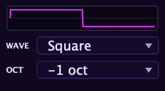

Under the three main oscillators sit a **sub oscillator** (with its own wave and
octave for adding weight below the fundamental) and a **noise** source offering
several flavors, including tuned noise and a sample-and-hold source.

## Sub oscillator

The sub tracks the pitch you play and adds content at a fixed octave below. It is
the simplest, most direct way to add low-end weight to any patch without touching
the main oscillators. Its level sits alongside the other sources in the
[Mixer](/aconite-manual/sources/mixer/).

### Wave

Three shapes are available:

- **Sine**: a clean, round fundamental with no harmonics. Adds pure low-end mass
  without any brightness whatsoever. The right choice when you want weight that
  does not interfere with the mid-range character of the main oscillators.

- **Triangle**: slightly warmer than a sine with a trace of upper harmonics, but
  still smooth and unobtrusive. A good middle ground when you want the sub to be
  slightly more "present" without becoming a distinct voice.

- **Square**: the loudest and most harmonically active of the three. Adds not just
  the sub octave but its odd harmonics (third, fifth…), which can make the low end
  feel woolly or powerful depending on the patch. Useful when you specifically want
  the sub to contribute to the mid-range body, not just the bass.

### Octave

**Octave** switches the sub between one octave below (−1) and two octaves below
(−2) the played note. At −2, in the lower keyboard registers, the sub reaches
very low frequencies; make sure your monitoring can reproduce them, and watch
the [Mix Drive](/aconite-manual/sources/mixer/) if you push the sub level high,
as the low energy will drive the pre-filter stage hard.

:::tip
A sine sub at −1 is the quiet foundation of a huge number of patches,
especially basses and pads. Keep the sub level modest (around a third to half of
the main oscillator level) so it adds weight without washing out the filter's
response. The filter still shapes it, which means filter envelope sweeps
automatically include the sub content.
:::

## Noise

Aconite's noise source is not a single colour but a menu of seven distinct
flavours. Each one has a different spectral balance, and some have their own
controls that appear when selected. Noise level lives alongside the other sources
in the [Mixer](/aconite-manual/sources/mixer/).

### Spectral colours

**White**: equal energy at every frequency. Full, present, and balanced from low
to high. The classic starting point for wind, breath, and percussion noise.

**Pink**: energy falls off at 3 dB per octave as frequency rises, which matches
the sensitivity curve of human hearing closely. Pink noise sounds perceptually
balanced, neither too thin nor too low-heavy. Good for natural breath, air, and
ambience textures.

**Red / Brown**: energy falls off more steeply, concentrating power in the bass
and low-mid. A deep, rumbling texture that can underpin bass sounds or provide a
sub-conscious low-end presence.

**Blue**: energy rises with frequency, the opposite of pink. Brighter and more
hissing than white. Useful for air, high-end sheen, or textural brightness when
you need noise that cuts through.

**Violet**: even more high-frequency emphasis than blue. Very bright, close to
a hiss or a spray. Useful in small amounts for high-end texture or layered into
bright percussive transients.

### Tuned noise

**Tuned** is a band-pass-filtered noise source with three controls:

- **Tune**: the centre frequency of the band-pass filter, from low rumble to
  high hiss. The noise only passes frequencies near this centre.
- **Reso**: the resonance (Q) of the band-pass filter, from a wide, gentle band
  to a very narrow resonant peak. High resonance makes Tuned noise sound almost
  pitched: a useful bridge between noise and tone.
- **Keytrack**: when turned up, the Tune centre follows the played note pitch.
  With high Reso and Keytrack, Tuned noise becomes an almost-pitched voice
  that rises and falls with the keyboard, useful for breath, reed simulation,
  or atmospheric pitched textures.

:::tip
Layer Tuned noise (high Reso, Keytrack on) with a Silk saw oscillator for an
instant breathy flute or shakuhachi character. The noise provides the breathiness;
the oscillator provides the pitch. Feed both through
[the filter](/aconite-manual/filters/the-two-filters/) with moderate cutoff and
low resonance to blend them together naturally.
:::

### Sample & Hold

**Sample & Hold** is a stepped noise source: the classic S&H generator of
modular synthesis, here used as an audio-rate noise flavour rather than a
modulation source. It produces a random staircase of values:

- **Rate**: how fast the random value changes. At slow rates you get a coarse,
  chunky, almost melodic randomness; at fast rates it approaches a rougher,
  buzzing texture closer to digital noise.
- An **interpolation** control smooths (or leaves stepped) the transitions between
  values. Left unsmoothed, the steps are hard and bright; smoothed, the texture
  blurs into something closer to filtered noise with a characteristic undulation.

Sample & Hold noise fed into the filter, especially with some resonance, can
produce robotic, glitchy, and random-pitched textures that none of the spectral
colours reach.

### Noise through the filter

All noise flavours run through the [filter](/aconite-manual/filters/the-two-filters/)
exactly like the oscillators do. This means the noise is shaped by Cutoff and
Resonance, responds to filter envelopes, and can be filtered down to a narrow
band. Turning up Resonance with white or pink noise is one of the fastest routes
to a wind or breath whoosh: the resonant peak sweeps through the noise as you
move Cutoff, giving the noise a pitched, wind-chime quality.

You can also route noise into the [modulation matrix](/aconite-manual/modulation/matrix/)
as a source to modulate other parameters directly, which is separate from using
it here as an audio source in the mixer.
